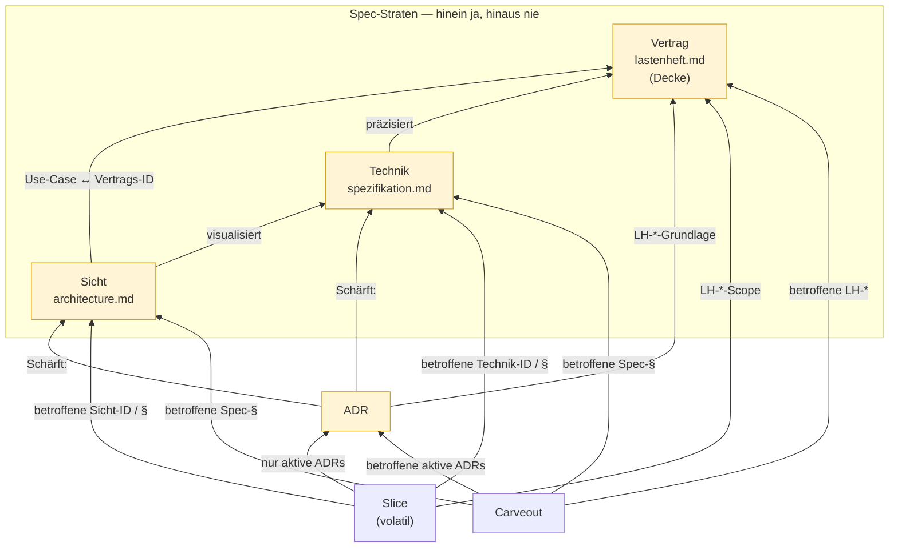
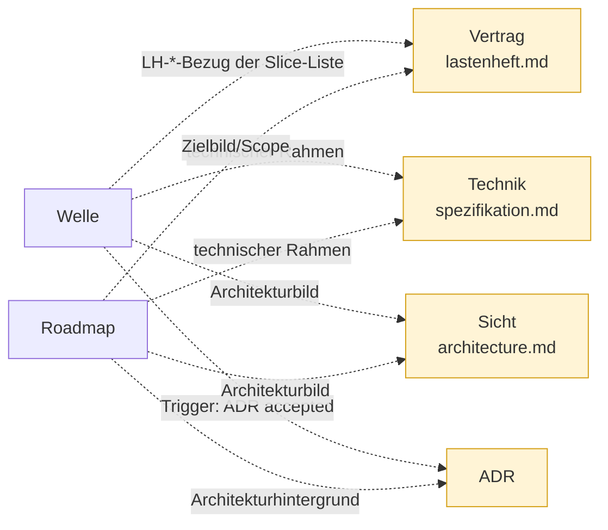
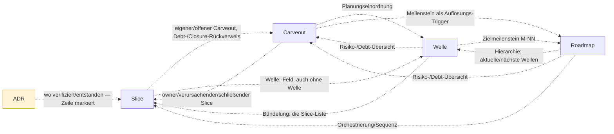

## Referenz-Richtung (SDP)
<!-- Quelle: [grundlagen/referenz-richtung.md](https://github.com/pt9912/ai-harness-course/blob/v6.5.0/kurs/de/grundlagen/referenz-richtung.md) -->

### Referenz-Richtung (SDP): wer darf wen referenzieren

Das ID-Schema *verbindet* Artefakte — aber nicht jede Verbindung ist
erlaubt. Welche Referenz *normativ* wirken darf, regelt eine einzige
Asymmetrie, das **Stable Dependencies Principle**: Abhängigkeiten zeigen
zum Stabileren. Die [§Spec-Stratifizierung](grundlagen-source-precedence.md#spec-stratifizierung)
ist der Spezialfall *innerhalb* von `spec/` ("ADR darf Spezifikation
schärfen, nie das Lastenheft"); die folgende Matrix dehnt dieselbe Logik
auf die ganze Artefakt-Kette aus.

**Stabilitäts-Rang** (stabil → volatil):
**Vertrag › Technik › Sicht › ADR › Slice**. `lastenheft.md` instanziiert das
Vertrags-Stratum, `spezifikation.md` das Technik-, `architecture.md` das
Sicht-Stratum; welches Dokument in welches Stratum fällt, regelt
[§Spec-Straten](#spec-straten-mehr-als-ein-spec-dokument). Carveout liegt auf
Slice-Ebene, Welle und Roadmap außerhalb. Wir kollabieren
Martins kontinuierliche Instabilitäts-Metrik (`I = Ce/(Ca+Ce)`) bewusst
auf einen **Typ-Rang** — die Artefakt-Taxonomie ist endlich und benannt,
damit wird die Regel lehr- und prüfbar.

> **Die Matrix-Zeilen sind Stratum-*Klassen*, nicht Dateinamen.** Die
> Dateinamen in der Kopfzeile sind die üblichen Instanzen; ein Projekt kann
> mehrere Vertrags-, Technik- und Sicht-Dokumente haben. Wie ein neues
> Spec-Dokument einem Stratum
> zugeordnet wird — und warum die Decke nicht fix `lastenheft.md` ist —
> regelt [§Spec-Straten](#spec-straten-mehr-als-ein-spec-dokument) unten.

| Dokument ↓ referenziert → | Vertrag `lastenheft.md` | Technik `spezifikation.md` | Sicht `architecture.md` | ADR | Slice | Carveout | Welle | Roadmap |
| --- | --- | --- | --- | --- | --- | --- | --- | --- |
| **Vertrag** (Decke) | intra (Peers) — nur `LH-*` untereinander | ❌ | ❌ | ❌ | ❌ | ❌ | ❌ | ❌ |
| **Technik** | Normativ: präzisiert Vertrag, Vertrag gewinnt | intra (Peers) | ❌ | ❌ | ❌ | ❌ | ❌ | ❌ |
| **Sicht** | Normativ: Use-Case ↔ Vertrags-ID | Normativ: visualisiert | intra (Peers) | ❌ | ❌ | ❌ | ❌ | ❌ |
| **ADR** | Normativ: `LH-*`-Grundlage | Normativ: **`Schärft:`** | Normativ: **`Schärft:`** | Normativ/Lineage: aktive ADRs als Grundlage; superseded nur ADR-interne Historie | Kontext: **wo** verifiziert/entstanden, nie **warum** entschieden — der zulässige Zeiger wird in seiner Zeile markiert | ❌ | ❌ | ❌ |
| **Slice** | Normativ: `LH-*`-Scope | Normativ: betroffene Technik-ID, ersatzweise Spec-§ | Normativ: betroffene Sicht-ID, ersatzweise Spec-§ | Normativ: nur aktive ADRs | Kontext: triggered-by, blocked-by, follow-up-of | Kontext: eigener/offener Carveout, Debt-/Closure-Rückverweis | Kontext: `Welle:`-Feld, auch „ohne Welle“ | ❌ |
| **Carveout** | Normativ: betroffene `LH-*` | Normativ: betroffene Spec-§ | Normativ: betroffene Spec-§ | Normativ: betroffene aktive ADRs | Kontext/Traceability: owner/verursachender/schließender Slice | Kontext: ersetzt/zusammengeführt/abhängig | Kontext: Planungseinordnung | Kontext: Meilenstein als Auflösungs-Trigger |
| **Welle** | Kontext: `LH-*`-Bezug der Slice-Liste | Kontext: technischer Rahmen | Kontext: Architekturbild | Kontext: Trigger (`ADR-<NNNN>` accepted) | Kontext: Bündelung — die Slice-Liste | Kontext: Risiko-/Debt-Übersicht | Kontext: Vorgänger-Welle als Trigger | Kontext: Zielmeilenstein `M<NN>` |
| **Roadmap** | Kontext: Zielbild/Scope | Kontext: technischer Rahmen | Kontext: Architekturbild | Kontext: Architekturhintergrund | Kontext: Orchestrierung/Sequenz | Kontext: Risiko-/Debt-Übersicht | Kontext: Hierarchie — aktuelle und nächste Wellen | intra: Meilenstein ↔ Welle |

Die drei Spec-Zeilen sind **identisch bis auf die Diagonale**: links davon nur
*Normativ aufwärts*, rechts davon nur ❌. Das ist die **Decken-Regel** — sie
gilt für alle drei Straten, nicht nur für den Vertrag.

**Technik-ID** meint `SPEC-*` oder eine Verfeinerung `<PREFIX>-FA-<NN>.<Buchstabe>`,
**Sicht-ID** meint `ARC-*`; welche Kennung wo entsteht, steht in
[`grundlagen-source-precedence.md` §ID-Schema](grundlagen-source-precedence.md#id-schema-als-klammer).
Trägt das Zielelement keine, bleibt der `§`-Anker zulässig.

**Warum die Carveout-Zeile beim Abschnitt bleibt.** Was ein Carveout
ausklammert, ist ein *Stück Geltung* — ein Gate, das für einen Pfad-Cluster
ausgesetzt ist —, und das sitzt selten auf genau einer Kennung. Sein Kopf führt
dafür auch kein Feld: Die sechs Pflichtfelder
([`modul-07-carveouts.md`](modul-07-carveouts.md)) benennen Gate und
Geltungsbereich, nicht eine Spec-Stelle.

**Welle und Roadmap sind zwei Zeilen, nicht eine.** Die Welle trägt das
*Bündel* (Ziel, Trigger, Slice-Liste), die Roadmap die *Reihenfolge* (aktuelle
Welle, nächste Wellen, Meilensteine). Ihre Reihenfolge in der Matrix folgt der
Zeigerichtung — **Slice → Welle → Roadmap**: Der Slice nennt seine Welle, die
Welle ihren Zielmeilenstein. Getrennt wird sichtbar, was zusammengefasst
unsichtbar blieb: Ein Slice nennt **nie** die Roadmap — und was von außen doch
auf sie zeigt (Carveout, Welle), zeigt auf einen **Meilenstein**, nie auf die
Planung selbst.

**Das Bild zeigt die normativen Kanten.** Sie bilden einen strikt aufwärts
gerichteten azyklischen Graphen; kein Baum, denn Slice, Carveout und ADR haben
je *zwei* normative Eltern (Slice/Carveout → ADR *und* `LH-*`; ADR → `LH-*`
*und* Spec-§).

**Die Diagonale steht nur in der Matrix.** Intra-Peers, ADR-Lineage und die
Selbstbezüge von Slice, Carveout, Welle und Roadmap sind Kanten eines Knotens
auf sich selbst; die Bilder lassen sie weg, weil sie die Richtung überlagern,
um die es geht. Zusammen zeigen die drei Bilder deshalb jede Zelle
**außerhalb der Diagonale**, die kein ❌ trägt; die Kantentexte sind die
Zelltexte.

**Die Planungs-Ebene zeigt in den kanonischen Block, nie umgekehrt.** Welle
und Roadmap berufen sich auf Vertrag, Technik, Sicht und ADR — umgekehrt
beruft sich dort niemand auf sie. Genau das macht sie zur Planungs-, nicht zur
Spezifikations-Ebene.

**Die Planungs-Ebene führt Buch.** Slice, Carveout, Welle und Roadmap zeigen
wechselseitig aufeinander — wer verursacht, wer schließt, was blockiert, was
zusammen läuft. Dazu die einzige Kontext-Kante, die den kanonischen Block
**verlässt**: `ADR → Slice`. Sie ist deshalb die einzige, die eine Markierung
in ihrer Zeile verlangt; alle anderen bleiben in der Planungs-Ebene, wo
Abwärts-Verweise ohnehin erwartbar sind.

**Was von außen auf die Roadmap zeigt, zeigt auf einen Meilenstein** — der
Carveout als Auflösungs-Trigger, die Welle als Zielmeilenstein. Auf die
*Planung* selbst — welche Welle als nächstes läuft — beruft sich nichts: Sie
ist zu volatil, um Bezugspunkt zu sein. Deshalb trägt der Slice ein
`Welle:`-Feld und keinen Roadmap-Verweis.

**Kontext trägt keine Normkraft** — gestrichelt heißt: darf stehen, begründet
aber nichts.

**Tragende Regeln:**

1. **Normativ nur volatil → stabil.** Alles Richtung Slice oder zwischen
   Slices ist Planungskontext, keine Spezifikation.
2. **Autorität schlägt Stabilität.** Eine superseded ADR ist historisch
   stabil, aber nicht autoritativ — Slices referenzieren nur *aktive*
   ADRs. Die Supersedes-Kette bleibt ADR-intern.
3. **Carveout → Slice ist keine normative Abhängigkeit** — Schuld-,
   Ablauf- und Traceability-Buchführung (owner, Ursache, Closure). Die
   fachliche Begründung läuft nie über den Slice, sondern über `LH-*`
   oder aktive ADR.
4. **Welle und Roadmap stehen außerhalb der normativen Klammer** — die Welle
   bündelt (Ziel, Trigger, Slice-Liste), die Roadmap ordnet (Reihenfolge,
   Meilensteine); beide erzeugen keine Spezifikation.
5. **Provenance nur auf der Planungs-Ebene.** In einer abgegrenzten
   *Versions-/Historie-Tabelle am Dokument-Rand* ist ein Abwärts-Verweis
   Kontext — für ADR, Slice, Carveout und die Planungs-Ebene (die
   Slice-ID bleibt ein stabiler Token, auch nachdem die Datei nach
   `done/` wandert). **Für die Spec-Straten gilt das nicht:** Kein
   Spec-Dokument nennt eine ADR oder einen Slice, in keinem Abschnitt,
   auch nicht in seiner Historie.

   Der Grund ist nicht der Rang, sondern die **Unreparierbarkeit**. Eine
   Historie-Zeile ist ein Protokoll; sie wird nicht rückwirkend geändert.
   Wird die dort genannte ADR superseded, zeigt die Zeile dauerhaft auf
   eine Entscheidung, die nicht mehr gilt — und kein Gate meldet es, wenn
   die Sektion von der Prüfung ausgenommen ist. Im Körper ist derselbe
   Zeiger reparierbar, am Dokument-Rand ist er es nicht: Für rottende
   Verweise ist die Historie die *schlechteste* Stelle, nicht die
   harmloseste. Was eine Änderung auslöste, steht aufwärts — `Schärft:`
   in der ADR, Closure-Notiz im Slice.

   **Eine Verweis-Spalte trägt nur, was sonst nirgends im Repo steht.**
   Beim Vertrag ist das der externe CR — er hat kein anderes Zuhause.
   Technik und Sicht verankern ihre Aufwärts-Bezüge bereits im Körper
   (`LH-*` in Abschnitts-Überschriften und Begründungs-Spalten); dieselbe
   Kopplung ein zweites Mal in der Historie zu führen, erzeugt keine
   Information, sondern eine zweite Fassung, die driftet.

**ADR-Lineage vs. Carveout-Lineage — gleiche Form, andere Normativität.**
Die Diagonalzellen ADR→ADR und Carveout→Carveout sehen identisch aus
(supersede / depends-on / merged), tragen aber entgegengesetzte Kraft:

|  | Form | Normativ? | Warum |
| ----------------- | ------------------------ | :----------------: | ------------------------------------------------ |
| ADR→ADR | Supersedes, Depends-on | **ja** (Lineage) | ADRs sind *Entscheidungen* → tragen Autorität |
| Carveout→Carveout | ersetzt, zusammengeführt | **nein** (Kontext) | Carveouts sind *Schuld* → tragen nur Buchführung |

Die Matrix entscheidet damit nicht über *Linktypen*, sondern über
*Artefaktnatur* — derselbe Pfeil bedeutet je nach Quell-Artefakt etwas
anderes.

**Prüfung — zwei Ebenen.** Die Referenz-Regeln zerfallen in *mechanisch
entscheidbare* und *semantische* Kanten; ein einzelner grep deckt nur die
erste Hälfte ab.

*Maschineller Gate (fail-closed in `make verify`)* —
eine *computational feedforward*-Kontrolle wie der
[Traceability-Constraint](grundlagen-traceability.md#traceability-constraint):

- ein Spec-Stratum (`lastenheft.md`, `spezifikation.md`, `architecture.md`)
enthält `ADR-` oder `slice-` → fail, **ohne ausgenommene Sektion**
- Slice referenziert eine ADR mit `Status: Superseded` → fail

Die ausgenommene Überschrift (z. B. `## Geschichte` oder die
Versions-Tabelle), unter der Provenance nach Regel 5 leben darf, gibt es
nur auf der **Planungs-Ebene**. Über den Spec-Straten läuft der Check über
das ganze Dokument — gäbe es dort eine ausgenommene Sektion, wäre sie genau
die Stelle, an der die Verweise erfahrungsgemäß landen.

*Aufwärts-Kanten als klickbare Links — und ihre Reifestufe.* Die erlaubten
Aufwärts-Referenzen — die ADR-Felder `**Bezug:**` und `**Schärft:**`
([§Spec-Straten](#spec-straten-mehr-als-ein-spec-dokument)) — werden als
**Markdown-Link** geschrieben, nicht als nackte ID, so kommt der Leser
direkt zur Quelle. Der
Das Gate hier prüft aber nur die *Token-Richtung* (kein
`ADR-`/`slice-` abwärts im Spec-Körper), **nicht** die Link-/Anker-Auflösung:
Wird eine Ziel-Überschrift umbenannt, rottet der Aufwärts-Link *still* — die
gleiche Rot-Klasse, die wir abwärts verboten haben, nur unbewacht. Die
mechanisch erzwungene Reifestufe löst Links auf, prüft Anker-Existenz und
erzwingt die volle Matrix am Zielknoten. Die Baseline liefert bewusst nur die
grep-Variante aus — sie hält die mechanische Hälfte minimal und lesbar; die
anker-validierende Stufe ist eine Reifestufe darüber, kein Startwert.

*Mechanisierbar — über den umgekehrten Default.* Ob eine ADR→Slice-Referenz
ein erlaubter *Verifikations-Zeiger/Provenance* oder eine verbotene
*Entscheidungsgrundlage* ist, ist eine semantische Unterscheidung. Sie ist
darum aber **nicht unprüfbar**: Ein naiver grep über den ADR-Body flaggte
legitime Zeiger falsch-positiv (etwa „`make test-determinism` (slice-NNN)
verifiziert auch LH-FA-NNN") — die Bauform, die trägt, ist eine andere.
**Die Kante gilt als verboten, und die Ausnahme wird am Ort deklariert.**
Der Autor markiert den zulässigen Zeiger in seiner Zeile, der Sensor
erzwingt alles Übrige; dieselbe Form wie bei jeder deklarierten Ausnahme
(Carveout mit Trigger, `ignore`-Eintrag mit Begründung). Auch die Rangfolge
*innerhalb* der Spec-Klasse — Vertrag ↛ Technik ↛ Sicht — ist so erzwingbar,
nicht nur Spec ↛ ADR/Slice.

Was dem Reviewer bleibt, ist das, was kein Sensor prüfen kann: ob die
Markierung **ehrlich** gesetzt ist. Faustregel: *referenziert die ADR den
Slice, um eine Entscheidung zu **begründen** (verboten) oder um zu zeigen,
wo sie **verifiziert/entstanden** ist (erlaubt)?* Wer den Marker setzt, um
einen Befund loszuwerden, hat die Regel nicht erfüllt, sondern umgangen.

Bereits `Accepted`-ADRs sind immutable: vor Einführung dieser Konvention
entstandene Grenzfälle werden **grandfathered**, nicht durch eine
superseding ADR nachgezogen. Der Gate prüft nur ab Einführung neu.

#### Spec-Straten: mehr als ein Spec-Dokument

Reale Projekte haben mehr als drei Spec-Dateien — `api-spec.md`,
`data-model.md`, `sla.md`, `compliance.md`. Die Matrix operiert deshalb
auf **Stratum-Klassen** (Rolle), nicht auf Dateinamen. Jedes Spec-Dokument
fällt über zwei Achsen — *normativer Gehalt* und *Änderungs-Prozess* — in
genau ein Stratum:

| Stratum | Normativer Gehalt | Änderungs-Prozess | Default-Datei | typisch auch |
| ------------------- | ---------------------------------------- | ------------------------------------- | ------------------ | ------------------------------ |
| **Vertrag** (Decke) | eigene Anforderungen, abnahmebindend | Change Request | `lastenheft.md` | `compliance.md`, `sla.md` |
| **Technik** | eigene technische Festlegungen | fortschreibbar, ADR-Schärfung erlaubt | `spezifikation.md` | `api-spec.md`, `data-model.md` |
| **Sicht** | *keine* eigenen Anforderungen, derivativ | Diagramm-/View-Update | `architecture.md` | `deployment.md`, Sequenz-Views |

**Alle drei Straten sind obligatorisch.** Ein Repo, das etwas baut, trifft
technische Festlegungen — und für die gibt es keinen anderen zulässigen Ort.
Im Vertrag wären sie abnahmebindend und nur per Change Request änderbar; in
der Sicht widersprächen sie deren Derivativität. „Falten" verschiebt deshalb
nicht Inhalt zwischen Dateien, es ändert seinen **Änderungs-Prozess** — und
genau der definiert das Stratum mit. Das Technik-Stratum existiert darum auch
dann, wenn es dünn ist: Es ist der einzige Ort für eine Festlegung, die wir
selbst gesetzt haben und selbst fortschreiben dürfen, und es ist das Ziel der
`Schärft:`-Kante — ohne es hätte die einzige normative ADR→Spec-Kante nur noch
die Sicht.

Ein Repo *kann* mit zwei Straten fahren. Dann ist das eine **Abweichung von
der Baseline und wird als `MR-<NNN>` deklariert**, nicht durch Weglassen
erledigt — ein Stratum, das niemand deklariert hat, ist eine stille Setzung
(dieselbe Klasse wie ein undeklariertes Gate).

Generalisierter Rang: **Vertrag › Technik › Sicht › ADR › Slice** —
deckungsgleich mit „Lastenheft sticht Spezifikation sticht Architektur"
([§Spec-Stratifizierung](grundlagen-source-precedence.md#spec-stratifizierung), [§Source Precedence](grundlagen-source-precedence.md#source-precedence))
und der [Artefaktkette](grundlagen-begriffe.md#kernbegriffe). (Die
drei Ordnungen — Herleitung, Konflikt-Autorität, Referenz-Stabilität —
fallen für diese Kette *zusammen*; sie divergieren nur an der
superseded-ADR-Grenze, Regel 2.)

Die ADR ist die *Begründungs*-Schicht **unter** den Spec-Straten — und
**ihre Kanten zeigen aufwärts**:

- **ADR → `LH-*`**: die ADR referenziert die Anforderung, die sie begründet
  (wie in der Hauptmatrix).
- **ADR → Spec-§**: die ADR *deklariert, was sie schärft* (Acceptance-
  Trigger, [§Vier Trigger-Klassen](grundlagen-bootstrap.md#vier-trigger-klassen)). **Hier wohnt
  die Änderungskopplung**: wer die ADR ändert, liest aus ihr selbst, welche
  Spec-Stellen nachzuziehen sind.

Die Gegenrichtung **Spec → ADR existiert im bindenden Text nicht** — und
auch nicht als geduldete Quellen-Spalte: der Wert steht für sich, das Warum
findet man über die *aufwärts* zeigende ADR. Die einzige tolerierte
Provenance ist die Historie-/Changelog-Tabelle am Dokument-Rand (Regel 5),
sonst nichts — ein Abwärts-Zeiger im Spec-Körper rottet, sobald ADRs
superseded werden, und die Discovery läuft ohnehin von der ADR-Seite. Damit
zeigt **jede** Kante strikt aufwärts; null Abwärts-Kanten im bindenden Text,
Provenance nur unter `## Historie`. Der Referenz-Richtungs-Gate setzt diese
Decken-Regel über *alle* Spec-Straten durch, nicht nur über das Lastenheft.
**Innerhalb** eines Stratums sind Dokumente *Peers*: Intra-Referenzen
erlaubt (wie intra-`LH-*`), keine normative Querabhängigkeit, die Zyklen
baut.

Die Reference-Regeln je Stratum stehen in der Matrix oben — die drei
Spec-Zeilen ([§Referenz-Richtung (SDP)](#referenz-richtung-sdp-wer-darf-wen-referenzieren)).
Sie standen hier einmal ein zweites Mal; zwei Fassungen derselben Regel
driften.

Was dort nur als ❌ erscheint, hat einen Grund, der hierher gehört:
**Spec → ADR existiert im bindenden Text nicht — auch nicht als
Quellen-Spalte.** Die aufwärts zeigende ADR trägt alles (ADR → `LH-*` bzw.
ADR → Spec-§); das Lastenheft wird dabei *nie* geschärft.

**Platzierung wird deklariert, nicht geraten** — über zwei bestehende
Mechanismen:

1. **Die Kennungs-Form kodiert das Stratum** — und die Muster sind disjunkt zu
   lesen: `<PREFIX>-FA-<NN>` **ohne** Suffix → Vertrag; derselbe Name **mit**
   `.<Buchstabe>` sowie `SPEC-*` → Technik; `ARC-*` → Sicht; die Matrix
   adressiert Technik und Sicht darüber, mit dem `§`-Anker als Rückfallweg,
   wo ein Element keine Kennung trägt. Eine
   Sicht-Datei trägt sehr wohl `ARC-*`-*Struktur*-IDs
   (Komponenten, Schnittstellen), nur keine eigenen *Anforderungs*-IDs —
   das macht sie derivativ. Siehe [§ID-Schema](grundlagen-source-precedence.md#id-schema-als-klammer).
2. **Deklaration in `harness/conventions.md`** (Adaptions-Block, wie die
   Zusatzklassen für Sensors-Bindung). Ein Spec-Dokument ohne deklariertes
   Stratum ist eine *stille Setzung* — dieselbe Harness-Lüge-Klasse wie ein
   undeklariertes Gate — und **nicht normativ zitierbar**, bis es deklariert
   ist (analog Phase 4 „freigegeben für Verweise von außen").

**Die zwei Achsen sind nicht gleich belastbar.** Widersprechen sie einander,
entscheidet der **Änderungs-Prozess**. Der normative Gehalt ist Auslegung —
zwei kompetente Leser können dauerhaft uneins bleiben, ob ein Dokument eigene
Anforderungen *trägt* oder eine fremde nur *identifiziert*. Der
Änderungs-Prozess ist dagegen beobachtbar: *Wer darf diese Datei ändern, und
mit wessen Einverständnis?* Die Stratum-Definitionen selbst sind über den
Prozess formuliert („Change Request", „fortschreibbar", „Diagramm-Update") —
die Gehalts-Spalte beschreibt, die Prozess-Spalte entscheidet.

**Die Genre-Falle.** Eine vertraute Dokument-Gattung legt ein Stratum nahe,
weil ihre *Form* an eines erinnert. **Form ist kein Beleg** — sie sagt, wie
ein Dokument aussieht, nicht, wer es ändern darf. Ein Genre-Name ersetzt die
zwei Achsen nicht, er verdeckt sie nur. Das steht **nicht** gegen Mechanismus 1:
Die Kennungs-Form *deklariert* das Stratum, sie belegt es nicht — sie ist die
Erklärung des Autors, nicht das Aussehen der Gattung. Wer eine
`<PREFIX>-FA-<NN>` vergibt, sagt „Vertrag"; wer Given/When/Then schreibt, sagt
gar nichts.

Probe am Fall: die **User Story**. Sie schreibt ihre Akzeptanzkriterien in
Given/When/Then — in genau der Form, die auch das Lastenheft für seine
`LH-FA-*` verlangt. Nach Form gälte: Vertrag. Nach Achse 2 nicht: Eine Story
wird im Refinement geändert, laufend und teamintern, ohne Vereinbarung mit dem
Auftraggeber. Damit scheidet das Vertrags-Stratum aus, das über den Change
Request definiert ist — und mit ihm Technik (sie trifft keine technische
Festlegung) und Sicht (sie ist nicht derivativ). Die User Story ist **kein
Spec-Dokument**, sondern **Slice-Klasse**: kleinste lieferbare Einheit, eigener
Plan, eigene DoD, volatil. Sie gehört unter `docs/plan/planning/`. Ein
`spec/user-stories/` hebt ein volatiles Artefakt über die Decke.

**Die Decke ist nicht fix.** Ein Policy/Compliance-Repo rankt Regulatorik
*über* das Lastenheft („wir müssen" begrenzt „wir versprechen", siehe
[§Source Precedence](grundlagen-source-precedence.md#source-precedence)). Die Stratum-*Klassen* sind
universal; die konkrete Rangwahl innerhalb des Vertrags-Stratums ist
projektspezifisch und gehört in `harness/conventions.md`.
