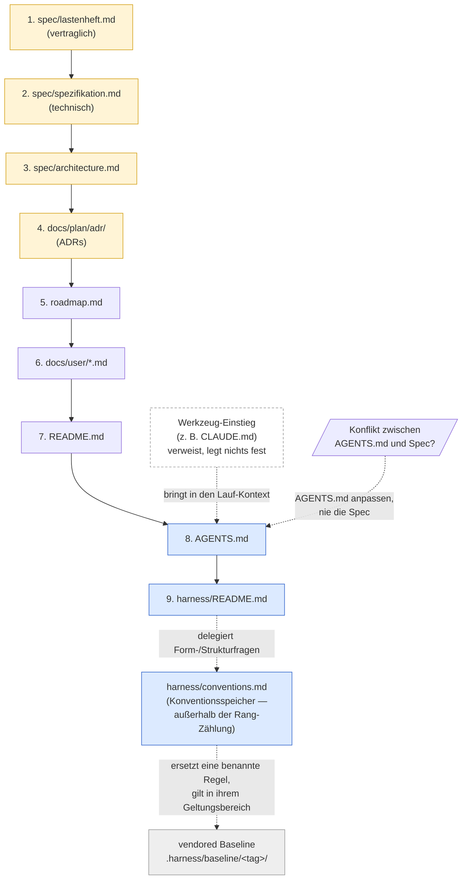
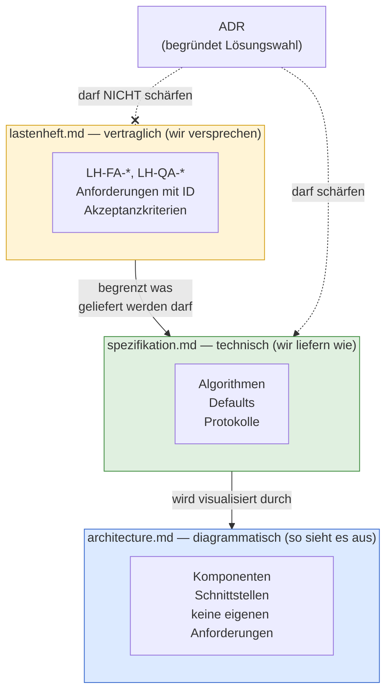

## Source Precedence und Spec-Stratifizierung
<!-- Quelle: [grundlagen/source-precedence.md](https://github.com/pt9912/ai-harness-course/blob/v6.5.0/kurs/de/grundlagen/source-precedence.md) -->

### Source Precedence

Sobald mehr als ein Dokument existiert, gibt es Konflikte. Der Harness
muss vorher festlegen, wer gewinnt. Eine pragmatische Default-Reihenfolge
für ein typisches Repo:

1. `spec/lastenheft.md`
2. `spec/spezifikation.md`
3. `spec/architecture.md`
4. `docs/plan/adr/README.md` und die darin referenzierten ADRs
5. `docs/plan/planning/in-progress/roadmap.md`
6. `docs/user/*.md` (Betriebs-/Operations-Docs — Quality-, Releasing- und
Runbook-*Sichten*)
7. `README.md`
8. `AGENTS.md`
9. `harness/README.md`



Gelb: kanonische Quellen — Spec, Architektur, ADRs. Blau: Harness-Index
und Agenten-Konventionen — sie *beschreiben* die kanonischen Quellen,
sie *ersetzen* sie nicht — `harness/conventions.md` beschreibt sie nicht,
sondern setzt repo-lokale Struktur. Grau: adoptierte Baseline, kein
Repo-Dokument. Weiß gestrichelt: der Werkzeug-Einstieg — er steht in keinem
Rang und legt nichts fest, er bringt `AGENTS.md` in den Lauf-Kontext.
Durchgezogene Kanten sind die Rangfolge, gestrichelte sind
Zuständigkeits- und Auflösungsbeziehungen.

Regel: Widerspricht `AGENTS.md`, `harness/README.md` oder
`harness/conventions.md` einer kanonischen Quelle, wird die niedriger
rangierte Datei angepasst — nie die kanonische Quelle. Der Harness folgt
der Spec, nicht umgekehrt.

**Die Harness-Schicht darunter: `conventions.md`, die Baseline und der
Werkzeug-Einstieg.** Drei Dinge stehen bewusst **nicht** in der Rangliste.
`harness/conventions.md`
ist kein weiterer Rang, sondern der **Konventionsspeicher**, an den die
rangierten Dokumente Form- und Strukturfragen *abtreten*: ID-Schemata,
Verzeichniskonvention, Zusatzklassen, Modus-Deklarationen, Adaptionen
([§harness/conventions.md als Konventionsspeicher](grundlagen-harness-dateien.md#harnessconventionsmd-als-konventionsspeicher)).
Wo `AGENTS.md` oder `harness/README.md` zu einer solchen Frage nichts sagen,
entsteht deshalb **kein Konflikt, sondern eine Zuständigkeit** — die Rangliste
entscheidet über *Inhalt*, der Konventionsspeicher über *Form*. Der Platz
wäre ohnehin aufgebraucht — neun Ränge, das
Maximum aus [Modul 1](modul-01-entwicklungszyklus.md).

Das vendored Regelwerk unter `.harness/baseline/<tag>/` steht noch darunter —
übernommenes Fremdmaterial, keine Aussage dieses Repos. Der Anschluss läuft
über den Konventionsspeicher: **Eine `MR-<NNN>` gilt innerhalb ihres
deklarierten Geltungsbereichs vor der Baseline; außerhalb davon gilt die
Baseline unverändert.** Das ist keine zusätzliche Regel, sondern die
Definition einer Adaption — sie steht hier, weil ein Agent, der nur die
Rangliste liest, die Antwort sonst nicht findet.

**Das Dritte ist der Werkzeug-Einstieg.** Die Wurzel-Datei, die ein
Agenten-Werkzeug automatisch lädt, ist kein Rang, sondern der **Mechanismus**,
der die geforderte Quelle in den Lauf-Kontext bringt: `AGENTS.md` gehört dort in
**jeden** Lauf, und bei einem Werkzeug, das eine andere Datei zuerst liest, löst
genau diese Datei die Forderung ein. Sie **verweist** deshalb — und legt nichts
fest. Anders als die zwei davor: Konventionsspeicher und Baseline *dürfen*
festlegen, jeder in seiner Rolle; der Einstieg nicht.

**Vollständigkeit.** Jede Regel, der ein Agent folgen muss, steht in einer
gerankten Quelle, im Konventionsspeicher oder in der adoptierten Baseline —
den drei Orten dieser Schicht. Artefakte außerhalb — Werkzeug-Einstiege,
Skill- und Command-Dateien, emittierte Fragmente — dürfen **verweisen**,
**ausführen** und einen dort gerankten Ablauf **ausbuchstabieren**, aber nichts
**festlegen**, was nicht dort steht. Ein Workflow-Skelett, das die kanonische
Schrittfolge vorgibt, buchstabiert aus; eines, das eine eigene Regel einführt,
legt fest. Ohne diesen Satz ist eine Datei außerhalb der Rangliste nicht
verboten, sondern nur unsichtbar.

**Prüffrage.** *Steht jede Aussage dieser Datei auch in einer gerankten Quelle?*
Nein ⇒ die Aussage ist eine **Waise**: Sie gehört nach `AGENTS.md`
**umgezogen**, nicht gelöscht.

**Reihenfolge beim Aufräumen** — sie ist das Eigentliche: **(1)** zeilenweise
belegen, wo jede Aussage gerankt steht; **(2)** Waisen umziehen und dabei am
Kanon ausrichten; **(3)** *erst dann* kürzen. Wer mit (3) beginnt, löscht
bindende Regeln — und merkt es nicht, weil sie nirgends sonst standen. Einen
Sensor dafür gibt es nicht: Welche Datei normativen Text trägt, steht nicht in
der Datei. Es bleibt ein Review-Griff.

Daraus folgt die Grenze — sie liegt in der *Wirkung*, nicht im Feld
`Geltungsbereich` (das nennt den Repo-Ausschnitt; den Baseline-Ausschnitt nennt
das eigene Feld `Ersetzt-Baseline-Regel`): Eine `MR-<NNN>`, die
die Baseline **pauschal für nicht anwendbar erklärt**, statt eine benannte Regel
zu ersetzen, ist kein Adaptions-Eintrag mehr, sondern ein **Fork** — sie nimmt
der Baseline die Eigenschaft, gegen die man auditieren kann. *Gelesen wird die Grenze beim **Schreiben** eines Eintrags* — der Adaptions-Block der
`conventions`-Vorlage schickt den Autor hierher; sie ist Entwurfszeit-Regel,
kein Prüfpunkt der Closure. Eine repo-weite
`MR-<NNN>`, die *eine benannte Regel* ersetzt, ist dagegen eine normale
Adaption, und ein Eintrag, der *keine* Abweichung deklariert — die
Baseline-Aussage `MR-000` —, ist weder Fork noch Adaption, sondern die
Adoptions-Erklärung selbst. (Eine *fehlende* Geltungsbereichs-Angabe ist kein
eigener Fall,
sondern ein Formfehler: Das Feld ist Pflicht.) Wird eine `MR-<NNN>`
durch ein Baseline-Update **gegenstandslos**, wird sie nicht überschrieben:
Sie bekommt einen Nachfolger, der sie auflöst und den Baseline-Stand nennt,
der die Ablösung ausgelöst hat — dieselbe Append-only-Disziplin
wie bei ADRs. Widerspricht sie der neuen Fassung, gilt sie in ihrem
Geltungsbereich weiter; der Widerspruch gehört aber benannt
([Modul 2 §Freshness-Audit](modul-02-harness-bootstrap.md#freshness-audit-der-vendored-baseline-schritt-2)).

**Universal vs projektabhängig.** *Dass* eine Source Precedence existiert
und dass bei Konflikt die niedriger rangierte Quelle angepasst wird, ist
universal (Hard Rule). *Welche* Rangordnung konkret gilt, ist
projektspezifische Entscheidung — die obige Liste ist eine pragmatische
Default-Reihenfolge für ein typisches Referenz/Tooling-Repo, kein
Gesetz. Andere Repo-Klassen können abweichende Rangordnungen begründen:
ein Safety/Control-Repo kann Hardware-Specs vor Software-Specs ranken;
ein Policy/Compliance-Repo kann Regulatorik-Anforderungen vor das
Lastenheft ranken (weil "wir versprechen" durch "wir müssen" begrenzt
wird). Die konkret getroffene Rangwahl und ihre Begründung gehören in
den Adaptions-Block des repo-lokalen Konventionsdokuments (Default-Pfad
`harness/conventions.md`).

**Wie weit trägt ein zitierter Satz?** Die zwei Antworten oben — die
`MR-<NNN>` in ihrem Geltungsbereich, die Rangordnung in ihrer universalen
Hälfte — beantworten die Frage je für ihren Fall. Sie ist an **jede**
zitierte Aussage zu stellen, auch an einen Satz der Baseline: *Gilt er auch
außerhalb des Falls, für den er geschrieben wurde?*

### Spec-Stratifizierung

`spec/` zerfällt selbst in drei Straten mit eigener Precedence — alle drei
obligatorisch ([§Spec-Straten](grundlagen-referenz-richtung.md#spec-straten-mehr-als-ein-spec-dokument)):

| Datei | Charakter | Änderungs-Prozess |
| ----------------------- | ----------------------------------------------------------------------------- | --------------------- |
| `spec/lastenheft.md` | **vertraglich abnahmebindend** (`LH-*` / `HSM-*`-IDs) | Change Request |
| `spec/spezifikation.md` | **technisch verbindlich, fortschreibbar** (Algorithmen, Defaults, Protokolle) | ADR-Schärfung erlaubt |
| `spec/architecture.md` | Diagramme, Komponentensicht, **keine eigenen Anforderungen** | Diagramm-Update |



Drei Schichten, drei Änderungs-Prozesse. Die kritische Hard Rule:
**ADRs DÜRFEN die Spezifikation schärfen, DÜRFEN NICHT das Lastenheft
schärfen.** Diese eine Regel kapselt die gesamte Trennung von
"wir liefern" und "wir versprechen".

„Change Request" ist **bewusst kein Harness-Konstrukt** — kein
`CR-*`-ID-Schema, keine eigene Datei, kein Gate — sondern der *externe*
Vorgang, in dem eine Vertragsänderung mit dem Auftraggeber vereinbart
wird. Im Repo hinterlässt ein *angenommener* Change Request nur einen
**Fußabdruck**: ein Version-Bump des Lastenhefts, eine Zeile in dessen
`## Historie` mit Verweis auf den externen CR (Ticket, Vertragsanhang),
und die geänderten `LH-*`/`HSM-*` selbst. Abgelehnte oder schwebende
CRs leben außerhalb des Repos. Weil nur dieser externe Prozess das
Lastenheft ändern darf, gilt die Hard Rule für *jede* interne Quelle:
**weder ADR noch Slice dürfen `LH-*` je ändern** — sie referenzieren
nur.

**Fallen Auftraggeber- und Entwickler-Rolle zusammen**, fehlt nicht der
Vorgang, sondern nur seine Ticket-Form: Die Rolle ist besetzt, und der
annehmende Akt ist die Entscheidung, die *vor* der Umsetzung fällt. Was die
Regel trägt, ist nicht die **Externalität**, sondern die **Trennung von
Entscheidung und Umsetzung** — und die ist auch ohne Ticket herstellbar. Der
Träger ist dann der **Commit**: Ein angenommener Change Request ändert in
einem eigenen Commit **ausschließlich** das Lastenheft und liegt **vor** dem
Slice, der ihn umsetzt; die Verweis-Spalte nennt diesen Vorgang statt eines
Tickets. Nachträglich ablesbar an `git log -- spec/lastenheft.md`.

Das ist keine Lockerung: Die Hard Rule bleibt, dass **keine interne Quelle**
`LH-*` ändert. Ein Slice, der das Lastenheft im selben Commit mitzieht, hat
die Trennung verloren — gleich, ob ein Ticket existiert oder nicht. Ein Sensor
dafür existiert nicht (kein d-check-Modul prüft, welche Dateien ein Commit
zusammen anfasst); es bleibt ein Review-Griff.

**Wann die CR-Pflicht beginnt, sagt der Status des Lastenhefts.** Er steht in
dessen Kopf und gilt dem **Dokument**, nicht der einzelnen Anforderung:
*Draft* · *In Review* · *Accepted*. Vor `Accepted` ist das Lastenheft ein
Entwurf — frei änderbar, ohne Change Request, ohne Historie-Zeile; die Trennung
von Entscheidung und Umsetzung greift noch nicht, weil noch nichts versprochen
wurde. Ab `Accepted` ist **jede** Änderung am Dokument eine Vertragsänderung:
auch das **Hinzufügen** einer neuen `LH-*`. „Neu" ist keine Ausnahme — eine
zusätzliche Anforderung erweitert das Versprechen, und genau diesen Vorgang
trägt der Change Request.

**Die eine Ausnahme ist die Tatsachenberichtigung**: eine Stelle, die etwas
anderes behauptete, als vereinbart war. Sie ändert nicht das Versprechen,
sondern dessen falsche Wiedergabe, und braucht deshalb keinen Change Request —
unter zwei Bedingungen: Sie wird in der Historie **als solche ausgewiesen**,
und sie berührt keine Aussage einer Anforderung. Wer eine Sinn-Änderung als
Berichtigung etikettiert, hat nicht abgekürzt, sondern die Trennung von
Entscheidung und Umsetzung verloren; eine Umformulierung, die den Sinn
*berührt*, ist Vertragsänderung. Ihr Fußabdruck ist derselbe **minus CR**:
Version-Bump und Historie-Zeile bleiben — der Vorgang ist belegt —, und die
Spalte „Verweis" trägt `—`, weil es keinen externen Vorgang gibt, den sie
nennen könnte.

**Zurückgezogen wird markiert, nicht gelöscht.** Eine `LH-*`, deren Bedarf
ersatzlos entfällt, bleibt mit dem Vermerk *zurückgezogen* im Titel stehen —
sichtbar beim Überfliegen, ohne eigene Notation; ihre Nummer
bleibt vergeben ([§Vergabe](#vergabe-woher-die-nächste-nummer-kommt) — Lücken
werden nicht nachbelegt). Das ist dieselbe Unterscheidung, die die ADR zwischen
`superseded` und `deprecated` trifft: *Bedarf bleibt, Antwort wechselt* ist eine
gewöhnliche CR-Änderung; *Bedarf existiert nicht mehr* ist die Rücknahme.
Gelöscht wären beide unsichtbar — und jeder Slice, der die Kennung nennt, zeigte
ins Leere.

**Welche Stelle der Version steigt, entscheidet das Repo** und gehört in den
Adaptions-Block von `harness/conventions.md` — wie die Rangwahl innerhalb des
Vertrags-Stratums. Verlangt ist der Bump als Fußabdruck, nicht eine bestimmte
Stelle.

### ID-Schema als Klammer

Ein konsistentes Präfix (`LH-*`, `HSM-*`, `GG-*`) verbindet:

* Anforderung in `spec/lastenheft.md`
* Make-Target-Kommentar (`coverage-gate: ## LH-FA-BUILD-008`)
* ADR-Body (`Bezug: HSM-LESE-004`)
* Commit-Message
* PR-Beschreibung

Damit wird der Traceability-Constraint maschinell prüfbar.

**Die Kennungs-Form sagt das Stratum.** Das Vertrags-Präfix ist frei wählbar —
`LH`, `HSM`, `GG` sind Projektvokabular. Die beiden anderen Straten tragen
feste Präfixe, weil sie nichts Projektspezifisches transportieren, sondern
die Zugehörigkeit selbst. Beim Vertrags-Präfix entscheidet dagegen der
**Suffix**: `LH-FA-03` ist Vertrag, `LH-FA-03.a` ist dessen Verfeinerung im
Technik-Stratum. Wer nur aufs Präfix schaut, ordnet die Verfeinerung eine
Schicht zu hoch ein.

| Kennung | Stratum | Art |
| --- | --- | --- |
| `<PREFIX>-FA-<NN>`, `<PREFIX>-QA-<NN>` | Vertrag (`spec/lastenheft.md`) | **Anforderungs-ID** — das Einzige, was abgenommen wird |
| `<PREFIX>-FA-<NN>.<Buchstabe>` | Technik (`spec/spezifikation.md`) | **Verfeinerung** genau einer Anforderungs-ID |
| `SPEC-<NNN>` | Technik (`spec/spezifikation.md`) | **Struktur-ID** für eine technische Festlegung ohne eigene Anforderung |
| `ARC-<NNN>` | Sicht (`spec/architecture.md`) | **Struktur-ID** für Komponente oder Schnittstelle |

Die Zählteile stehen hier ohne Bereichssegment; `LH-FA-03` und `LH-FA-IDX-003`
sind beide wohlgeformt. Welche Kennung eines braucht, entscheidet
[§Vergabe](#vergabe-woher-die-nächste-nummer-kommt) unten.

`SPEC-*` und `ARC-*` sind **keine** Anforderungs-IDs. Sie machen adressierbar,
was in ihrem Stratum ohnehin steht — ein Datenschema, ein Default, ein
Fehler-Code, eine Komponente —, und verpflichten zu nichts. Das ist der
Unterschied, an dem die Straten-Ordnung hängt: Eine Sicht mit `ARC-*` bleibt
derivativ, weil eine Kennung keine Zusage ist. Wer unter einer `SPEC-*` etwas
verspricht, was das Lastenheft nicht verspricht, hat nicht die ID missbraucht,
sondern die Regel *präzisieren, nie erweitern* gebrochen.

Eine Struktur-ID tritt **neben** einen fachlichen Schlüssel, sie ersetzt ihn
nicht. Ein Fehler-Code `E001` ist ein Laufzeit-Symbol; die `SPEC-*` daneben
benennt die *Festlegung* „`E001` bedeutet dies und löst jenes aus". Deshalb
bekommt auch eine Sektion mit eigener Schlüsselspalte Kennungen — sonst hätte
eine ADR, die die Fehlerbehandlung schärft, kein Ziel.

Zwei Kennungen im selben Stratum sind kein Widerspruch, sondern die Antwort auf
zwei verschiedene Fragen: `<PREFIX>-FA-03.a` sagt *"so erfüllen wir FA-03"*,
`SPEC-014` sagt *"das gilt hier, ohne dass es jemand versprochen hat"*. Ein
Abschnitt, der eine einzelne Anforderung verfeinert, trägt die Verfeinerung;
alles Übrige trägt `SPEC-*`.

**Die Klammer trägt die Anforderungs-ID, nicht jede Kennung.** Was aus dem Repo
*heraus* zeigt — Commit-Message, PR-Beschreibung, Make-Target-Kommentar —,
nennt die Anforderung und die ADR-Nummer: Beide beantworten die Frage, welche
Zusage oder Entscheidung berührt ist. Eine Struktur-ID beantwortet sie nicht;
`SPEC-014` in einer Commit-Message sagt einem Reviewer nichts, was er nicht
ohnehin im Diff sieht.

**Nach innen wird die ID referenziert, ersatzweise der Abschnitt.** Wer aus ADR
oder Slice auf Technik oder Sicht zeigt, nennt die Kennung, wenn das
Zielelement eine trägt, und sonst den `§`-Anker — nicht jeder Absatz braucht
eine Kennung, und eine erzwungene ID über Fließtext benennt nichts, sie
nummeriert nur. Der Carveout bleibt grundsätzlich beim Abschnitt
(Begründung in [§Referenz-Richtung (SDP)](grundlagen-referenz-richtung.md#referenz-richtung-sdp-wer-darf-wen-referenzieren)).

**Der Link trägt den Abschnitt, der Text die Kennung.** Kennungen in
Tabellenzellen bekommen keinen *automatischen* HTML-Anker; ein Verweis auf
`SPEC-015` zeigt technisch auf die Sektion, in der die Zeile steht. Ein
Doku-Sensor prüft darum den Anker, nie die Kennung: Wird eine `SPEC-*`
umbenannt oder gestrichen, bleiben verweisende ADRs still veraltet. Das ist ein
Review-Griff, kein Gate — wer eine Kennung anfasst, sucht ihre Nennungen selbst.

Eine Zeile lässt sich **explizit** adressierbar machen — ein `<a id="…"></a>` in
der Kennungs-Zelle —, und das lohnt genau dann, wenn ihre Datei-Position
wandert, ihre Zeile aber bleibt: bei den `MR`-Zeilen des Adaptions-Index
([`grundlagen-harness-dateien.md` §`harness/conventions.md` als Konventionsspeicher](grundlagen-harness-dateien.md#harnessconventionsmd-als-konventionsspeicher)).
Für die Spec-Straten gilt das nicht — dort wandert nichts, und ein Anker je
Zeile wäre Pflege ohne Gegenwert.

#### Vergabe: woher die nächste Nummer kommt

Das Präfix sagt, *wozu* eine Kennung gehört. Offen bleibt, **wer die Nummer
vergibt** — und diese Frage hat nur solange keine Antwort nötig, wie genau ein
Mensch am Repo schreibt.

**Die Kollisionsfläche ist nicht die Nummer, sondern die Ablage.** `LH-*` lebt
in *einer* Datei: Zwei gleichzeitige Anforderungen erzeugen einen
Git-Konflikt — laut, sofort, unübersehbar. ADR, Slice, Welle und Carveout sind
**je eine eigene Datei**: Zwei Entwickler, die unabhängig `0012` ziehen,
erzeugen `0012-cache.md` und `0012-index.md`. Git meldet nichts, der Merge
gelingt, und im Repo stehen zwei Artefakte unter derselben Kennung — die
Klammer zwischen Spec, Commit und Gate ist zerrissen, ohne dass ein Sensor
angeschlagen hätte.

**`MR-<NNN>` ist ein Hybrid aus beiden Klassen.** Der Eintrag lebt als eigene
Datei (still), seine Index-Zeile in `harness/conventions.md` als Zeile einer
Tabelle (laut): Zwei gleichzeitige `MR-005` erzeugen zwei Dateien, die lautlos
nebeneinander liegen — und zwei Index-Zeilen, die kollidieren, wenn sie
benachbart landen. Lauter als ADR und Slice, aber nicht garantiert laut.

**Struktur-IDs stehen auf der lauten Seite.** `SPEC-*` und `ARC-*` leben zu
vielen in *einer* Datei und teilen damit die Eigenschaft von `LH-*`: Zwei
gleichzeitig vergebene Nummern stehen hinterher sichtbar untereinander, im
selben Diff, im selben Merge-Konflikt. Sie brauchen deshalb **kein
Bereichssegment**. Gezählt wird **fortlaufend je Datei** — die nächste freie
Nummer ist die höchste vergebene plus eins, gleich in welchem Abschnitt sie
steht; Lücken werden nicht nachbelegt, weil eine wiederverwendete Kennung
ältere Verweise stillschweigend umlenkt. Ein Segment sicherte hier nichts, was
der Diff nicht ohnehin zeigt, und bände den Zählraum an eine Sub-Area, die für
ein Spec-Dokument gar nicht definiert ist.

**Für die Artefakte mit je eigener Datei ist der Zählraum die Sub-Area.** Die
Kennung trägt ein Bereichssegment, und gezählt wird *innerhalb* dieses Bereichs:

```
ADR-IDX-0004      ADR-AUTH-0001      slice-IDX-007      CO-AUTH-002
```

Die Bereiche sind nicht neu zu erfinden — es sind die **Sub-Areas**, die
`harness/conventions.md` ohnehin einzeln deklariert
([§Was ist eine Sub-Area?](grundlagen-bootstrap.md#was-ist-eine-sub-area)). Damit ist die
nächste Nummer **lokal ableitbar**: Wer in `IDX` arbeitet, sieht im eigenen
Checkout, welche `IDX`-Kennungen vergeben sind, und braucht dafür weder eine
Absprache noch einen Schreibzugriff auf den Hauptzweig. Das ist die
Bedingung, die aus dem [Traceability-Constraint](grundlagen-traceability.md#traceability-constraint)
folgt: Die Kennung steht in Commits, **sobald die Arbeit läuft** — wer sie erst
beim Landen bekommt, hat sie im entscheidenden Moment nicht.

**Das Segment wird nachgeschlagen, nicht formuliert.** Welches Kürzel eine
Sub-Area trägt, steht in ihrer Modus-Deklaration
([§Konventionsspeicher](grundlagen-harness-dateien.md#harnessconventionsmd-als-konventionsspeicher)) —
nicht im Kopf dessen, der gerade eine Kennung vergibt.

**Die Welle fällt aus diesem Schema.** Sie bündelt Slices über Sub-Areas
hinweg — es gibt keine Sub-Area, in der man sie zählen könnte; ein
`welle-IDX-03` wäre eine falsche Aussage über den Geltungsbereich. Für die
Welle bleibt es beim dichten, repo-weiten Zählraum, und das Risiko trägt die
Eröffnung: Sie ist Planner-Arbeit und schreibt die Roadmap — den lauten
Kollisionspunkt.

**Und „lokal ableitbar" hat eine Grenze: Der Zählraum ist größer als das
Verzeichnis.** Auch eine offene Welle vergibt Nummern — ihr §4 nennt Slices,
die noch keine Datei haben —, und was in einem offenen PR liegt, ist im
eigenen Checkout nicht sichtbar. Wer die nächste Nummer zieht, liest deshalb
Verzeichnis **und** offene Welle-Dateien; den PR-Rest fängt das Schema nicht,
und das gehört gesagt.

**Abzugrenzen vom Beanspruchen.** Ohne Schreibzugriff auf den Hauptzweig kommt
nur die *Nummer* aus. Das *Beanspruchen* einer Arbeit landet dort sehr wohl —
der Lifecycle-Übergang `next → in-progress` ist ein Commit auf dem Hauptzweig,
vor der Arbeit ([Modul 5 §Lifecycle als State Machine](modul-05-planning-harness.md#lifecycle-als-state-machine)).
Die beiden Aussagen widersprechen sich nicht: Die eine gilt dem **Ableiten
einer Kennung**, die andere dem **Sichtbarmachen eines Anspruchs**.

**Was das leistet, und was nicht.** Zwei Entwickler in *verschiedenen*
Sub-Areas können nicht kollidieren. Zwei in *derselben* schon — und das ist
Absicht: Sie entscheiden gleichzeitig über denselben Bereich und sollten
voneinander wissen. Das Schema verwandelt einen stillen Merge-Unfall in ein
inhaltliches Signal; es beseitigt ihn nicht. Ein Personen- oder Branch-Segment
gäbe die Garantie, altert aber mit der Person und sagt dem Reviewer nichts.

**Das Segment ist Herkunft, nicht Zugehörigkeit.** Es hält fest, in welchem
Bereich das Artefakt *entstand*. Wird eine Sub-Area später geteilt oder
umbenannt, ändern sich **keine** bestehenden Kennungen — dieselbe Stabilität
wie bei der Slice-ID, die nach dem Wandern in `done/` ein stabiler Token
bleibt.

**Mischung ist billiger als Migration.** Ein Repo, das das Segment später
einführt, behält die alten Kennungen und vergibt nur neue mit Bereich. Zwei
Formen nebeneinander sind unschön, aber harmlos; ein Umbenennen aller
bestehenden Kennungen bräche jede Commit-Message, die sie zitiert.

**Welche Form gilt, deklariert das Repo.** Ein Repo mit einem schreibenden
Menschen braucht kein Segment — dichte Nummern sind dort billiger und
lesbarer. Die Wahl gehört in die ID-Schema-Deklaration in
`harness/conventions.md`, wo `<PREFIX>-FA-*`, `ADR-<NNNN>` und `CO-<NNN>`
ohnehin festgelegt werden — nicht in eine stille Gewohnheit. Wer später von
dicht auf Bereich wechselt, notiert den Wechselpunkt; bestehende Kennungen
bleiben, wie sie sind.

**Kein Sensor.** Die Doppelvergabe wäre in beiden Formen erkennbar — zwei
Dateien mit demselben Bereich-Nummer-Paar in einem Verzeichnis, oder zwei
gleiche `SPEC-*` in einer Datei —, aber
kein Modul des Doku-Gates prüft Eindeutigkeit heute. Bis dahin ist es ein
Review-Griff, und das gehört gesagt, statt einen Gate zu behaupten.
