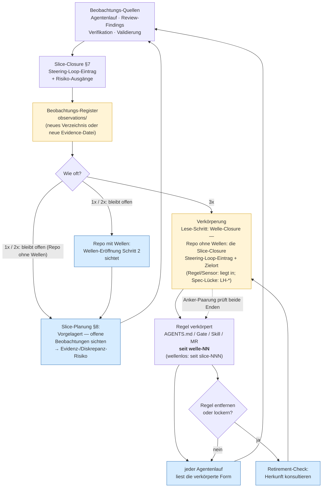

## Traceability-Constraint
<!-- Quelle: [grundlagen/traceability.md](https://github.com/pt9912/ai-harness-course/blob/v6.5.0/kurs/de/grundlagen/traceability.md) -->

### Traceability-Constraint

Keine relevante Änderung ohne Bezug zu mindestens einem der folgenden Punkte:

* Requirement-ID
* Architekturprinzip (die `ARC-*` der Sicht zählt nicht — Struktur-IDs
  adressieren innerhalb der Spec, siehe [`grundlagen-source-precedence.md` §ID-Schema](grundlagen-source-precedence.md#id-schema-als-klammer))
* ADR-ID
* Test, Gate oder Demo-Artefakt
* Dokumentations-Update, falls ein öffentlicher Vertrag betroffen ist

Das ist eine *computational feedforward*-Kontrolle (siehe
[`klassifikation.md`](grundlagen-klassifikation.md#klassifikation-und-steering-loop)): ein Commit-Hook prüft, dass
die Nachricht mindestens eine ID enthält. Billig, deterministisch, und
sie zwingt den Implementer-Agent in die Source-Precedence-Kette zurück.

#### Die zweite Richtung: Anforderung → Beleg

Der Constraint oben bindet **Änderungen** an eine ID. Er sagt nichts über
Anforderungen, die **nie** eine Änderung ausgelöst haben.

Der Auslesestand dieser zweiten Richtung heißt **Requirements Traceability
Matrix (RTM)**: je Anforderung ihre Belege, und sichtbar die **Waisen** — die
Anforderungen ohne einen. In regulierten Domänen wird sie von außen verlangt
(Klasse *Policy/Compliance-Flagship*).

**Sie wird erzeugt, nicht gepflegt.** Eine RTM als eigenes Dokument neben Tests,
Gates und ADRs ist ein zweites Verzeichnis von Beziehungen, die schon dastehen —
eine Kopie, und Kopien driften
([`grundlagen-source-precedence.md` §Source Precedence](grundlagen-source-precedence.md#source-precedence)). Der Auslesestand
entsteht aus den Ankern, die der Constraint ohnehin erzwingt.

**Was eine Anforderung entlastet, ist eine Setzung — und sie gehört
aufgeschrieben.** Ein Werkzeug listet Verweis-Quellen in Spalten, und nur die
Spalte, die du als *entlastend* deklarierst, macht aus einer Waise ein *ok*. Das
ist Konfiguration, keine Naturgesetzlichkeit: Dieselbe ADR entlastet oder
entlastet nicht, je nachdem, in welchen Slot ihr Verzeichnis zeigt.

Deshalb ist die Frage nicht *„welche Spalte gatet"*, sondern **welche Zusage
eine Anforderung schließt**. Der Vorschlag dieses Kurses: der **Slice**. Eine
ADR sagt *warum so* und begründet; ein Slice sagt *dass und wann gebaut wird*
und verpflichtet. Eine Anforderung mit ADR und ohne Slice ist begründet und
ungebaut — genau der Zustand, den die Matrix sichtbar machen soll, und deshalb
steht die ADR als eigene Spalte da und nicht als Quittung. Ein Repo, das das
anders schneidet — etwa eine kuratierte Nachweis-Datei als entlastende Quelle —,
trifft eine legitime andere Wahl und **deklariert sie**, wie jede Abweichung von
der Baseline.

**Bericht und Gate sind derselbe Lauf, nicht zwei Werkzeuge.** Der Bericht
listet auf; dasselbe mit einem Vollständigkeits-Schalter urteilt: mindestens
eine Waise, und der Lauf fällt.

**Nicht zu verwechseln** mit einer Richtungs-Prüfung über die Spec-Straten
(*welches Stratum darf wen nennen*, [`grundlagen-referenz-richtung.md` §Referenz-Richtung (SDP)](grundlagen-referenz-richtung.md#referenz-richtung-sdp-wer-darf-wen-referenzieren)).
Die prüft, ob ein Verweis erlaubt ist; die RTM, ob es ihn gibt. Werkzeuge
benennen beides gern ähnlich — der Unterschied ist Richtung gegen Abdeckung.

#### Herkunfts-Anker für Steering-Loop-Regeln

Der Traceability-Constraint bindet **Änderungen** an eine ID. Der
Herkunfts-Anker ist dieselbe Regel auf dem **Artefakt**: Eine Regel, die
aus dem Steering Loop entstand, nennt die Welle, in der sie entstand — oder,
wenn sie ohne Welle verkörpert wurde, den Slice: `seit welle-<NN>` bzw.
`seit slice-<NNN>`.

- **Geltungsbereich — eng.** Nur Regeln, die die 3×-Schwelle erreicht
  haben. Was aus Lastenheft, Spezifikation oder ADR folgt, trägt bereits
  eine ID und braucht keinen zweiten Anker.
- **Form** — ein Feld, kein Konstrukt:
  `noqa-gate:  ## LH-QA-SUP-002 · seit welle-3` (Make-Target) ·
  `coverage-floor: ## LH-QA-SUP-004 · seit slice-047` (wellenlos) ·
  `### 3.3 <Hard Rule>   (seit welle-3)` (AGENTS.md) ·
  `- <HIGH-Regel>  (seit welle-3)` (Reviewer-Skill). Der Adaptions-Block
  trägt das Muster bereits über sein Feld *Begründung*.
- **Die Welle ist der Regelfall, der Slice die Ausnahme.**
  `done/welle-<NN>-results.md` §Steering-Loop-Einträge nennt beim
  Schwellen-Übertritt *Regel · stabile Bezeichnung · Slice-Belege* — ein Anker
  löst damit in einem Hop auf und bleibt grob genug, um nicht zu verrotten.
  Wurde die Regel **ohne Welle** verkörpert, gibt es diese Datei nicht; dann
  ist der Slice die einzige auflösbare Herkunft (`seit slice-<NNN>`, löst über
  `done/slice-<NNN>-<kurzer-titel>.md` §7 auf — die Nummer ist eindeutig, der
  Titelrest gehört zum Dateinamen; maschinell also `done/slice-<NNN>-*.md`).
  **Nach dem Archivieren ist es ein Hop mehr** ([Modul 6](modul-06-roadmap.md),
  Schritt 4): An der Stelle des Slice liegt ein Stub unter `done/<welle-id>/`,
  §7 steht im Archiv. Der Anker bleibt gültig, die Auflösung ist zweistufig —
  erst der Stub, dann sein Archiv-Zeiger; die `Hervorgegangen:`-Zeile des Stubs
  nennt die Kennungen, die aus dem Slice hervorgingen.
- **Ab Einführung, kein Nachrüsten.** Bestehende Regeln haben keinen
  rekonstruierbaren Ursprung mehr; `seit unbekannt` wäre eine
  [Harness-Lüge](grundlagen-begriffe.md#kernbegriffe). Der leere Zustand *ist*
  die ehrliche Information.

**Sensor 1 — Anker-Paarung** (*computational feedback*). Die Prüfung läuft
**von der Closure-Notiz nach außen**, nicht von der Regel nach innen: von
der Regel aus ist nicht entscheidbar, ob sie einen Anker braucht.
**Ausgelöst wird durch ein Feld, nicht durch die Semantik des Eintrags und
nicht durch Prosa:** durch das Pflichtfeld **`liegt in <Zielort>`** — in
`## Steering-Loop-Einträge` jeder `welle-<NN>-results.md` und, für wellenlos
verkörperte Regeln, in §7 jeder `done/slice-<NNN>-<kurzer-titel>.md`; die
kanonischen Formen liefern `welle-results.template.md` bzw.
`slice.template.md` §7 (siehe Ziel-Form unten).

- **Das Feld gilt nur in diesen beiden Sektionen.** Überall sonst sind
  dieselben zwei Wörter gewöhnliche Sprache und lösen nichts aus — die
  Trigger-Formulierung „`slice-024` liegt in `done/`" (Modul 6) ebenso wenig
  wie eine bloße **Erwähnung** eines Pfades im Fließtext. Der Sektions-Scope grenzt den Auslöser ein,
  ersetzt ihn aber nicht: *innerhalb* der Sektion entscheidet das Feld.
- **Die Ruheort-Regel — für jede Datei, die per `git mv` wandert.** Ein
  Slice-Plan und ein Welle-Plan werden an einem Ort geschrieben und an einem
  anderen gelesen: Bei der Closure wandern sie nach `done/`. Jeder relative
  Pfad darin ist deshalb so zu schreiben, wie er **vom Ruheort** auflöst, nicht
  vom Schreibort — die Ergebnis-Notiz liegt in `done/` als Geschwister (ohne
  Präfix), das Beobachtungs-Register eine Ebene höher (Eltern-Verzeichnis, also mit `..`-Präfix).
  Ein im Schreibmoment richtiges `done/…` bricht für jeden Leser danach, und
  zwar still: Der Pfad bleibt syntaktisch intakt und zeigt ins Leere.
- **Und wo die Regel nicht anwendbar ist — die Gegenrichtung.** Sie setzt
  voraus, dass die Datei kurz am Schreibort und lange am Ruheort gelesen wird.
  Für einen Adaptions-Eintrag (`MR-<NNN>`) ist es umgekehrt: Er lebt seine
  ganze aktive Zeit in `harness/conventions/` und wandert erst bei der
  Auflösung nach `done/` — vom Ruheort geschriebene Pfade wären die ganze Zeit
  rot. Dort gilt deshalb die andere Hälfte: **Der `git mv` zieht die
  Pfad-Berichtigung nach sich**, als eigener Commit nach dem Umzug. Der
  Wächter ist die Existenzprüfung des Links.
- **Zwei Rot-Quellen, ein Prinzip.** Ein Verweis in die vendorte Baseline
  trägt neben der Tiefe auch deren **Version** (`.harness/baseline/<tag>/…`),
  und die bewegt sich bei jedem Baseline-Bump. Beide Male gilt dasselbe: nicht
  die Form wechseln, damit nichts mehr rotten kann, sondern das Rotten
  **sichtbar** machen. Für die Version heißt das: Der adoptierte Stand steht
  **einmal** im Adaptions-Block, und ein Versions-Sensor prüft jeden Pin
  dagegen. Ein vergessener Nachzug ist dann ein Befund, kein toter Link.
- **In den Backticks steht ein Zielort, nicht immer eine Datei** — drei
  kanonische Füllungen: `AGENTS.md §<N>` · `Makefile:<target>` ·
  `.harness/skills/<name>.md`.
- **Geprüft wird:** (1) der Pfad existiert, **ab Repo-Wurzel** — nicht relativ
  zur Closure-Notiz: Der Zielort zeigt aus dem Planungs-Baum hinaus und wandert
  nicht mit, wenn die Notiz nach `done/` wandert. Dafür wird ein Suffix ab
  ` §` oder ab `:` abgetrennt und der Rest als Pfad geprüft. (Die Pfade auf
  Nachbar-Artefakte — der Zeiger aufs Beobachtungs-Register — bleiben
  datei-relativ und folgen der Ruheort-Regel.) (2) Das Ziel trägt `seit welle-<NN>` bzw.
  `seit slice-<NNN>` — beim Make-Target auf dessen Target-Zeile, beim
  Abschnitt in dessen Überschrift, bei einer Datei ohne Suffix irgendwo in ihr.
- **Fehlt das Feld**, ist der Eintrag *gezählt, nicht verkörpert* und kein
  Gegenstand der Paarung. Ausnahme ohne Gegenausnahme: Eine **benannte
  Spec-Lücke** trägt kein `liegt in` und ist trotzdem verkörpert — in einer
  versionierten Spec statt an einem Zielort. Ihr Gegenstück ist die
  `LH-*`-ID; an der Register-Paarung (Modul 6) nimmt sie teil wie jeder
  andere Eintrag.

  **Beide Commits gehören in denselben Push.** Zwischen ihnen ist das Repo kurz
  rot; das ist zulässig, solange dieser Zwischenstand nicht die **Spitze** eines
  Push wird. Eine CI, die den Push-Tip prüft, sieht genau die Spitze — wandern
  beide Commits zusammen, ist der Tip der zweite. Wer den Move allein pusht,
  macht den roten Zwischenstand zum geprüften Stand.

Rot bei: Regel nie geschrieben · still gelöscht · Anker vergessen —
dieselbe Klasse wie ein halluziniertes Gate
([Modul 13](modul-13-quality-gates.md)).

> **Grenze:** Der Sensor erzwingt den Anker nur für **deklarierte**
> Steering-Loop-Regeln. Wer die Closure-Notiz nicht schreibt, wird nicht
> erwischt. Das ist die Grenze der Deklaration, nicht ein Fehler des
> Sensors — und sie gehört benannt.

**Sensor 2 — Retirement-Check** (*inferential feedback*,
ereignis-getriggert, kein periodischer Sweep): Eine Regel mit
Herkunfts-Anker wird **nicht entfernt oder gelockert**, ohne dass die
Herkunft konsultiert und das Ergebnis dokumentiert wurde — *„Regel seit
`welle-3` — ist die Beobachtung seither wieder aufgetreten?"*. Dieselbe
Bauart wie „Gates dürfen nicht ohne ADR gelockert werden", aber **kumulativ,
nicht ersetzend**: ist das verankerte Artefakt selbst ein Gate, gilt die
ADR-Pflicht unverändert weiter — der Retirement-Check beantwortet eine andere
Frage („ist der Grund entfallen?", nicht „darf ich?"). Er ist der
**Konsument** des Ankers; ohne ihn wäre der Anker eine zweite
write-only-Ablage.

Ziel-Form des Eintrags mit dem Pflichtfeld `liegt in <Zielort>` — zwei Orte, zwei
Vorlagen: für die Welle-Closure
[`../templates/docs/plan/planning/welle-results.template.md`](../templates/docs/plan/planning/welle-results.template.md),
für wellenlos verkörperte Regeln
[`../templates/docs/plan/planning/slice.template.md`](../templates/docs/plan/planning/slice.template.md)
§7.

**Jedes Artefakt hat einen Konsumenten** — die Regel steht in
[`grundlagen-harness-dateien.md` §Jedes Artefakt hat einen Konsumenten](grundlagen-harness-dateien.md#jedes-artefakt-hat-einen-konsumenten).
Diese Adresse bleibt bestehen, weil sie vor dem Umzug vergeben wurde.

**Der Fluss.** Gelb ist, was **geschrieben** wird, blau, was es **liest**:

Die beiden Schleifen tragen unterschiedliche Mengen: Die linke hält die
Beobachtungen **unter** der Schwelle am Leben (sonst zählt niemand hoch), die
rechte hält die Begründung der **verkörperten** Regeln greifbar (sonst werden
sie beim Aufräumen still entfernt). Keine ersetzt die andere.

**Und was hier *nicht* blau ist, sagt genauso viel.** Der Volltext eines
geschlossenen Slice kommt in keinem lesenden Knoten vor: Gelesen werden das
Register, die verkörperte Form und — beim Retirement-Check — die Herkunft.
Genau deshalb darf er ins Archiv wandern, während Register, Regel und Anker
bleiben ([Modul 6](modul-06-roadmap.md), Wellen-Closure Schritt 4; ohne Wellen
trägt es die Slice-Closure). Der eine Knoten, den das teurer macht, ist der
Retirement-Check: Er liest die Herkunft dann über den Stub und dessen
Archiv-Zeiger statt direkt.
