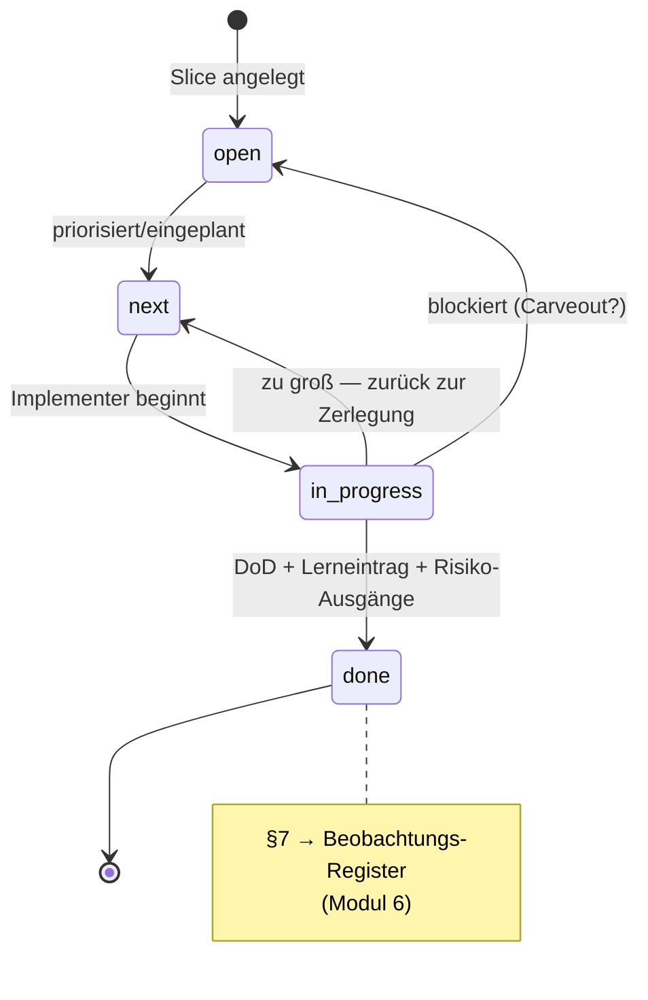

## Modul 5 — Planning Harness

<!-- Quelle: [02-planung/modul-05-planning-harness.md](https://github.com/pt9912/ai-harness-course/blob/v6.5.0/kurs/de/02-planung/modul-05-planning-harness.md) -->

### Kernidee (Modul 5)

Ein Slice ist klein, wenn ein Agent ihn in *einem* Lauf abschließen kann
und ein Reviewer den Diff *in einer Sitzung* prüfen kann. Größer ist
falsch.

### Lifecycle als State Machine

**Der Zustand ist das Verzeichnis, nicht ein Kopffeld.** Ein `Status:`-Feld im
Slice-Plan wäre eine zweite Quelle für denselben Zustand und driftet gegen die
Ablage. Ein Übergang ist deshalb ein **reiner `git mv`** — Inhaltsänderungen
stehen in einem eigenen Commit
([Modul 9 §Hard Rules](modul-09-implementierung.md#hard-rules-repo-spezifisch)),
bei der Closure nach `done/` in dem *davor*: DoD-Häkchen und Closure-Notiz
sind die Bedingung dafür, dass die Datei überhaupt nach `done/` darf.

**`open → next` setzt den Verantwortlichen.** Der Slice-Kopf trägt das Feld
`Verantwortlich:` — den Rolleninhaber der Implementer-Rolle, der die Arbeit
hält; bis zur Priorisierung steht dort `—`. Der **Autor** bleibt davon
getrennt: Er schrieb den Plan. Kein Statuswert: Der Zustand bleibt das
Verzeichnis, das Feld sagt *wer*, nicht *wo*. Ein Sensor prüft das Feld
nicht; es ist Deklaration.

**`next → in-progress` landet auf dem Hauptzweig, vor der Arbeit.** Reist der
`git mv` erst im PR mit, ist der Zustand **zweigelokal**: `in-progress/` ist
für alle anderen leer, bis die Arbeit fertig ist. Der Übergangs-Commit auf dem
Hauptzweig macht den Anspruch sichtbar, **bevor** jemand anderes dieselbe
Arbeit beginnt; der Branch entsteht danach.

**Die Regel trägt die Wirkung, nicht das Mittel.** Sichtbar werden muss der
Anspruch vor der Arbeit; der Direkt-Commit ist nur der Default-Träger. Wo der
Hauptzweig push-geschützt ist, scheitert er — dann
deklariert das Repo seinen Träger als `MR`: etwa eine Claim-Ausnahme im
Schutzregime oder ein Anspruchs-PR, der sofort gemergt wird. Still abweichen
ist keiner der beiden.

**Aussagen über die Verzeichnis-Position gelten für den gemergten Stand.**
Auf einem Zweig sieht man den eigenen — vollständiger als den Hauptzweig, aber
nur für sich. Wer eine `ls`-Antwort als team-weit liest, liest den Hauptzweig;
was in einem offenen PR liegt, ist für alle anderen noch nicht da.

**Drei Übergänge tragen eine Pflicht**, die über „Arbeit erledigt" hinausgeht.
`in_progress → done` ist der einzige Weg nach `done` und verlangt
*Lerneintrag* **und einen Ausgang für jedes offene Risiko**, nicht nur
"Tests grün". Die beiden **Rückführungen** `in_progress → next` (zu groß —
zurück zur Zerlegung) und `in_progress → open` (Blocker — meist mit Carveout,
siehe [Modul 7](modul-07-carveouts.md)) tragen **zwei** Pflichten an zwei
Zeitpunkten, die nicht zusammenfallen: **Vorab** benennt §4 des Slice-Plans die
*Bedingung* — unter welcher Beobachtung dieser Slice zurückgeht. **Im
Nachhinein**, beim Übergang selbst, wird der *Grund* nachgetragen: was
tatsächlich eintrat.

**Im Wellen-Betrieb ist `done/` auch nicht die letzte Station der Datei.**
Schließt die Welle, die diesen Slice einsammelt, wandert sein Volltext ins
Archiv, und an seiner Stelle bleibt ein gekürzter **Stub** — Identität,
Archiv-Zeiger, Zustand und die Kennungen, die den Slice überlebt haben
([Modul 6](modul-06-roadmap.md), Schritt 4). Die Verzeichnis-Position bleibt
der Zustand. **Ohne Wellen tut es die Slice-Closure selbst** — nach den
Paarungen, nach `done/slice-<NNN>-archiv.zip` flach neben dem Stub
([Modul 6](modul-06-roadmap.md), *Wann Arbeit eine Welle braucht*). Die Station
ist dieselbe, nur der Träger ein anderer.

`done` ist **kein Endzustand der Information**: Die Beobachtungen aus §7 sind
bei der Slice-Closure ins Beobachtungs-Register eingetragen und werden **von
dort** weitergelesen — vom Lese-Schritt (Welle-Closure; in einem Repo ohne
Wellen-Betrieb löst ihn die Slice-Closure selbst aus) und vom Sichtungs-Schritt
der Slice-Planung (§8 des Slice-Plans). Für wellenlos verkörperte Regeln zeigt
der Herkunfts-Anker `seit slice-<NNN>` auf genau dieses §7 in `done/` zurück.

### Trigger je Lifecycle-Übergang und WIP-Limit (Modul 5)

Alle fünf Übergänge mit Triggerbedingung:

- `open→next` — priorisiert/eingeplant, `Verantwortlich:` gesetzt.
- `next→in-progress` — Implementer übernimmt, Abhängigkeiten gelöst, WIP-Limit
  frei; der `git mv` landet auf dem Hauptzweig, vor der Arbeit.
- `in-progress→done` — Closure-Kriterien erfüllt, Lerneintrag geschrieben,
  jedes Risiko aus dem Slice-Plan mit Ausgang.
- `in-progress→next` — Slice zu groß, zurück zum Schneiden.
- `in-progress→open` — Blocker, Priorität offen.

Am leichtesten übersehen werden die *Rückführungen* — `in-progress→next`
und `in-progress→open` —, weil sie wie "Scheitern" aussehen, in Wahrheit
aber die Lifecycle-Disziplin tragen: ein Slice, der zu groß war, gehört
sichtbar zurück, nicht still weitergeschoben.

WIP-Limit pro Rolleninhaber = 1 ist eine harte Größe, kein Vorschlag — pro
Mensch in der Implementer-Rolle, nicht pro Rolle
([Modul 8](modul-08-agentenrollen.md#rollen-regeln-modul-8)); wer
mehrere Slices gleichzeitig in `in-progress/` hat, hat keine Lifecycle,
sondern ein Buffet.

### Closure- und Lerneintrag-Regeln (Modul 5)

- **Drei Quellen speisen den Closure-Eintrag:** eigene Beobachtung ·
  offenes Risiko aus dem Slice-Plan · **wiederkehrende Finding-Klasse aus
  dem Review** dieses Slice (Summary-Zeile des Review-Reports; der Report
  selbst ist Lauf-Beleg und wird über Läufe hinweg nicht gelesen,
  [Modul 10](modul-10-review-harness.md)). Alle drei nehmen dieselbe
  Route in den Zähler; der Pfad `BEO-<KUERZEL>/<slug>` hält sie zusammen, die
  Bezeichnung ist stabil zu halten, damit die Zuordnung gelingt.
- Übergang nach `done/` verlangt zwei beobachtbare Closure-Kriterien
  (z. B. Replay grün, DoD-Punkte als Test verlinkt) *und* einen
  Lerneintrag in einer der drei Formen (geschärfte Regel · neuer Sensor ·
  benannte Spec-Lücke).
- Der Lerneintrag schließt den Steering Loop — ohne ihn bleibt das
  Versagensmuster unsichtbar und wiederholt sich.
- Ein Slice darf bei rotem Gate nur mit dokumentiertem Carveout
  (Modul 7) in `done/` landen, der den roten Gate-Status auf Trigger
  schaltet. Unterscheidung: Carveout (Ausnahme, mit Folge-Slice) vs.
  bootstrap-aware Gate (Stufung, mit Hochschalt-Trigger, Modul 13). Die
  volle Werkzeug-Triade inkl. *BF-Sub-Area-Markierung* (Sub-Area-Kontext,
  kein Closure-Werkzeug) wird in
  [Modul 7 §Werkzeug-Wahl bei Diskrepanz](modul-07-carveouts.md#werkzeug-wahl)
  disambiguiert.

#### Offene Risiken werden bei Closure aufgelöst

Ein Risiko aus dem Slice-Plan (*Risiken und offene Punkte*) ist
Originalinformation und steht nirgendwo sonst. Jedes bekommt beim Übergang
nach `done/` genau **einen** Ausgang: *eingetreten* → Carveout (Modul 7)
oder Folge-Slice mit ID · *entfallen* → gestrichen **mit Begründung** (ohne
sie ist es stilles Vergessen) · *weiter offen* → wandert ins
**Beobachtungs-Register** ([Modul 6](modul-06-roadmap.md#das-beobachtungs-register-modul-6)). Der
dritte Ausgang hängt das Risiko an den Zähler, statt einen zweiten
Mechanismus zu erfinden: drei Slices lang offen heißt Schwelle erreicht.
Ein Slice geht nicht nach `done/`, während ein Risiko ohne Ausgang dasteht.
**Urteilsfrei** ist, *dass* zu jedem notierten Risiko ein Ausgang dasteht und
*welcher der drei* es ist: Die drei sind eine geschlossene Menge, kein Freitext
— ein Risiko ohne Ausgang und ein Ausgang, der keiner der drei ist, sind an der
**Form** erkennbar, nicht am Inhalt. **Urteil** bleibt, ob der eingetragene
Ausgang *trägt*: ob das Risiko wirklich nicht mehr eintreten kann, ob die
genannte Folge-Slice-ID die Realisierung tatsächlich auffängt. Das ist
dieselbe Arbeitsteilung wie beim Beobachtungs-Register
([Modul 6](modul-06-roadmap.md#das-beobachtungs-register-modul-6)) — Mensch
urteilt, Maschine prüft Deckung —, und sie bindet an denselben Punkt: den
Übergang nach `done`. *Welches* Werkzeug die urteilsfreie Hälfte prüft, ist
Repo-Entscheidung; dass sie eine hat, ist es nicht.

### Ziel-Form: Slice

Ein Slice-Plan folgt der Vorlage
[`templates/docs/plan/planning/slice.template.md`](../templates/docs/plan/planning/slice.template.md).
Größen- und Schnitt-Regeln:

- **Zu groß**, wenn eines zutrifft: mehr als drei **Liefer-Punkte** — gezählt
  wird nur, was mit dem Umfang wächst (die Artefakte und Akzeptanzkriterien
  dieses Slice). Nicht gezählt: Gate-Läufe, Review-Report, Closure-Notiz,
  Register, Risiko-Ausgänge, die drei Paarungen; sie sind pro Slice konstant
  und sagen über die Größe nichts · mehrere
  Schichten betroffen (Adapter + Service + UI + DB-Schema) · nicht in
  *einer* Review-Sitzung prüfbar. Dann zurück zum Schneiden
  (`in-progress→next`), nicht still weiterschieben.
- **Schnitt nach Lieferwert, nicht nach Schichten.** Ein Schicht-Schnitt
  (`…-db`, `…-service`, `…-ui`) erzeugt voneinander abhängige, einzeln
  nutzlose Zombie-Slices, die in `in-progress/` festhängen.
- Jeder Schnitt-Slice ist **einzeln lieferbar** (kein Slice wartet auf
  den nächsten), hat **≤ 3 Liefer-Punkte** und berührt **höchstens zwei
  Schichten**.
- **Der Kopf nennt die berührten Spec-Stellen.** Die Matrix weist dem Slice
  eine normative Kante nach Technik und Sicht zu
  ([`grundlagen-referenz-richtung.md` §Referenz-Richtung (SDP)](grundlagen-referenz-richtung.md#referenz-richtung-sdp-wer-darf-wen-referenzieren));
  damit sie auffindbar ist statt im Fließtext zu verschwinden, trägt der Kopf
  ein Feld dafür — Kennung, wo das Zielelement eine trägt, sonst der
  `§`-Anker, und `—`, wenn der Slice keine Spec-Stelle berührt. Daneben trägt
  der Kopf `Verantwortlich:` (§Lifecycle als State Machine) und `Autor:`.
- **§1 nennt Ziel *und* Abgrenzung.** Was ein Slice ausdrücklich *nicht* tut,
  gehört neben sein Ziel — das ist die **Out-of-Scope**-Disziplin des
  Lastenhefts ([Modul 3](modul-03-spec.md)) auf den Slice-Plan angewandt, und
  aus demselben Grund: Was nicht ausdrücklich ausgeschlossen ist, wandert im
  Zweifel hinein. **Je Punkt eine Begründung** — ein Ausschluss ohne Grund ist
  eine Behauptung, keine Grenze. Vier Klassen tragen den Abschnitt:

  1. **Ein Folge-Slice übernimmt es** — mit Kennung. Das macht aus „später"
     eine Adresse. Die Adresse muss die Sendung annehmen: Ein Folge-Slice, der
     den verwiesenen Punkt selbst ausschließt oder vor dem verweisenden
     schließt, ist keine.
  2. **Bestand bleibt bewusst stehen** — mit Begründung. Sonst meldet ein
     Sensor später gegen Altbestand, den niemand entschieden hat.
  3. **Es wäre ein anderer Vorgang** — trennt Arbeit am Gegenstand von Arbeit
     am Werkzeug.
  4. **Schicht-Abgrenzung** — hält den Slice in seiner Schicht. Sie sagt nicht,
     *wann* etwas kommt, sondern dass es *woanders* hingehört; für einen Slice,
     der Doku ändert, ist „kein Produkt-Code" die wirksamste Selbstbindung,
     weil sie beim Review sofort prüfbar ist.

  **Keine Mindestzahl, und kein Sensor darauf.** Ein Slice mit *einem* echten
  Ausschluss ist besser als einer mit vier erfundenen; ob ein Ausschluss trägt,
  ist ein Urteil, und ein Pflichtfeld erzeugt Pflichterfüllung. **Die
  Reichweite, beide Hälften:** Der Abschnitt hat bei einem Adopter dreimal
  nachweisbar getragen — jedes Mal als Adresse für Wachstum, das sonst
  stillschweigend mitgenommen worden wäre. Er hat aber nicht verhindert, dass
  ein Slice wächst; derselbe Bestand führt einen, der *mit* vollständigem
  Abschnitt von 3 auf 23 Träger wuchs. Er macht Wachstum **benennbar**, nicht
  unmöglich: Wer später mitnimmt, was hier ausgeschlossen war, hat den Plan
  geändert, nicht nur ergänzt.

### Ziel-Form: Sub-Area-Modus-Begründung

> Der Abschnittsname nennt die bedingte Hälfte; die zwei vorgelagerten
> Prüfungen darunter sind unbedingt. Der Name bleibt, weil er von Vorlage und
> Index adressiert wird — die Ziel-Form im Slice-Plan führt deshalb beide
> Hälften im Titel (§8 *Sub-Area-Prüfungen und Modus-Begründung*).

Der Bootstrap-Modus ist Eigenschaft *pro Sub-Area*, nicht pro Slice; ein
Slice berührt mehrere Sub-Areas und kann GF, BF und Hybrid gleichzeitig
involvieren. Pro berührter Sub-Area vier Pflichtkriterien (vier, nicht
erweitern):

1. **Konventionen-Dichte** — wieviel der berührten Doku-/Code-Sektion ist
   durch `harness/conventions.md` (oder ein gleichwertiges Artefakt) als
   Strukturregel verankert?
2. **Phase-Reife der berührten Artefakt-Sektionen** — Phase 0–5 aus der
   Phase × Modus-Matrix in [Modul 2](modul-02-harness-bootstrap.md#phasen--modus--die-zweidimensionale-reife-matrix).
3. **Evidenz- und Diskrepanz-Risiko** — wie groß ist die Gefahr, dass
   Inventur den Code-Bestand und die Doku-Aussage als divergent
   ausweist? Bei GF meist niedrig (Doc führt — Inventur prüft nur
   Code-Konformität); bei BF/Hybrid das Hauptrisiko, das die
   Reconciliation-Schätzung trägt. **Beleg-Quelle sind auch die offenen
   Beobachtungen** zu dieser Sub-Area (**Beobachtungs-Register**,
   [Modul 6](modul-06-roadmap.md#das-beobachtungs-register-modul-6)):
   ein Eintrag, der die Sub-Area schon zweimal getroffen hat, ist genau
   dieses Risiko — und wird er durch diesen Slice zum dritten Mal
   berührt, ist er keine Notiz mehr, sondern eine Lücke. Keine
   Treffer sind ebenfalls eine Antwort und werden notiert.
4. **Reconciliation-Aufwand inklusive Graduation-/Folge-Slice-Trigger** —
   wieviel Slice-Aufwand bringt BF/Hybrid mit sich, und welcher Trigger
   (eine der vier Klassen aus
   [`grundlagen-bootstrap.md` §Vier Trigger-Klassen](grundlagen-bootstrap.md#vier-trigger-klassen)
   — Sync, Promotion, Cross-Reference, Acceptance — oder eine
   Folge-Slice-ID) schaltet die Sub-Area Richtung GF?

#### Zwei Schritte vor der Modus-Begründung

Bevor der erste Block geschrieben wird, laufen zwei Prüfungen. Sie hängen
weder am Modus noch am Slice-Typ und stehen deshalb in **jedem** Slice-Plan —
auch bei reinem Refactor, auch wenn am Ende „alles GF" dasteht.

**Der Begründungsblock dagegen ist bedingt**, und das ist der Unterschied, den
die Gliederung tragen muss: Pflicht, sobald mindestens eine berührte Sub-Area
BF oder Hybrid ist — einer pro Sub-Area; bei reinem GF genügt der Hinweis
*„alle berührten Sub-Areas GF"*; bei reinem Refactor ohne neue
Sub-Area-Berührung entfällt **er** — nicht der Abschnitt, der ihn enthält. Ein
Abschnitt, dessen Titel nur die bedingte Hälfte nennt, lädt dazu ein, die
unbedingte mit ihr fallen zu lassen; deshalb nennt der Titel beide.

Die zwei Prüfungen:

1. **Sub-Area-Wahl prüfen.** Jede Sub-Area, die der Slice als berührt führt,
   muss das Inklusionskriterium erfüllen — drei Achsen, Schwelle ≥ 2
   ([`grundlagen-bootstrap.md` §Was ist eine Sub-Area?](grundlagen-bootstrap.md#was-ist-eine-sub-area)).
   Zu grobe Sub-Areas (*„Backend"*) werden **vorher** ausdifferenziert, sonst
   trägt der Begründungsblock mehrere Modi vermischt und keiner davon ist
   prüfbar.
2. **Offene Beobachtungen sichten.** Das
   [Beobachtungs-Register](modul-06-roadmap.md#das-beobachtungs-register-modul-6)
   durchgehen: Steht eine der berührten Sub-Areas dort? Dann gehört der
   Zähler-Stand ins Kriterium *Evidenz-/Diskrepanz-Risiko* — und erreicht der
   Eintrag mit diesem Slice 3×, ist er keine Notiz mehr, sondern eine Lücke und
   braucht einen eigenen Folge-Slice. **Keine Treffer sind ebenfalls eine
   Antwort** und werden notiert. Gelesen wird der **gemergte** Stand: Das
   Register ist beim Lesen so alt wie der letzte Merge — Erhöhungen reisen im
   PR mit.

In einem Repo **ohne Wellen-Betrieb** ist der zweite Schritt der *einzige*
Leser für alles, was unter der Schwelle steht — dort gibt es keine
Wellen-Eröffnung, die sichtet. Fällt er weg, zählt das Register weiter und
niemand schaut hin.

Der Begründungsblock pro Sub-Area ist
[**§8** des Slice-Plans](../templates/docs/plan/planning/slice.template.md):
Modus (GF/BF/Hybrid) · Konventionen-Dichte · Phase-Reife · Evidenz-/
Diskrepanz-Risiko · Reconciliation-Aufwand. Ein Block pro berührter
Sub-Area — so läuft die Modus-Entscheidung im Planning-Harness-Slice mit
und wird in der Closure-Notiz prüfbar.

### Regeln gegen typische Fehlannahmen (Modul 5)

- **Gegen "Slice = Ticket = Feature":** Drei verschiedene Granularitäten. Feature ist Spec-Ebene, Slice ist Implementations-Einheit, Ticket ist Projektmanagement. Slice ist die kleinste *agentisch abschließbare* Einheit.
- **Gegen "Erst plan ich alle Slices, dann fange ich an":** Wer alle Slices vor der ersten Implementation plant, plant tote Slices. Plan und Implementation alternieren — Welle für Welle.
- **Gegen "Wenn ein Slice in `done/` ist, ist er fertig":** Ohne Lerneintrag ist er nur *abgelegt*. Closure ist eine bewusste Reflexionsleistung: was hat funktioniert, was war Friktion, was geht in den Steering Loop?
- **Gegen "Ein Slice hat einen Bootstrap-Modus":** Der Modus ist Eigenschaft *pro Sub-Area* ([Modul 2 §Kernidee](modul-02-harness-bootstrap.md#kernidee-modul-2)). Ein Slice berührt mehrere Sub-Areas und kann GF, BF und Hybrid gleichzeitig involvieren.
- **Gegen "Wenn der Slice klein ist, ist die berührte Sub-Area GF":** Transitive Vereinfachung. Slice-Größe und Sub-Area-Modus sind orthogonale Achsen: Slice-Größe misst, ob der Schnitt in einer Review-Sitzung prüfbar ist; Sub-Area-Modus misst den Reifegrad der berührten Doku-/Code-Sektion. Ein kleiner Slice kann eine BF-Sub-Area berühren (Beispiel: Login-Endpoint ist klein, aber das Test-Layout für die Auth-Schicht ist nicht in `harness/conventions.md` verankert).

