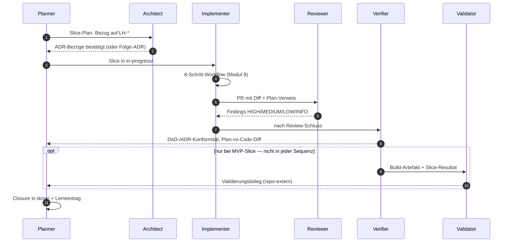

## Modul 8 — Agentenrollen

<!-- Quelle: [03-agenten/modul-08-agentenrollen.md](https://github.com/pt9912/ai-harness-course/blob/v6.5.0/kurs/de/03-agenten/modul-08-agentenrollen.md) -->

### Kernidee (Modul 8)

Rollentrennung verhindert, dass derselbe Kontext zweimal denselben Fehler
macht. Wer geplant hat, prüft nicht; wer geschrieben hat, reviewt nicht.

### Rollen-Sequenz für einen Slice

Wesentlich: keine Rolle springt rückwärts in eine vorhergehende, ohne
*Übergabe-Artefakt* (Findings, Folge-ADR-Vorschlag, Carveout). Der
Eingabe-Kontext jeder Rolle ist eingeschränkt — das verhindert, dass
dieselbe Sicht denselben Fehler übersieht.

### Rollen-Sequenz für eine Welle

Die Sequenz oben ist **slice-skopiert**. Die Welle hat ihre eigene Prozedur —
drei Eröffnungs- und sechs Closure-Schritte
([Modul 6](modul-06-roadmap.md#wellen-closure-prozedur-modul-6)). Es gilt
dieselbe Regel: **kein Rollenwechsel ohne Artefakt.** Nur sind es **sechs**
Übergaben, nicht neun — gezählt wie oben, ein Pfeil je Übergabe; sie bilden drei
**Züge** aus je einer Anfrage und einer Antwort.

**Die Eröffnung ist Planner-Arbeit** — alle drei Schritte laufen in *einem*
Kontext. Es gibt keine Eröffnungs-Sequenz, weil es keine Übergabe gibt; wer
hier eine zeichnet, erfindet einen Rollenwechsel.

Die Schritt-Nummern sind die der Closure-Prozedur, alle sechs; Schritt 3 hat
drei Teile.

| Closure-Schritt | Träger | Übergabe-Artefakt |
| --- | --- | --- |
| **1** — Trigger prüfen | **Verifier** → Planner | repo-weiter Verifikations-Beleg (`fullbuild`-Hash, Replay-Ergebnis); er geht über die Slice-DoDs hinaus und steht in keiner von ihnen |
| **2** — Trigger-Audit | Planner (Carveout-Zweig) · **Planner → Architect → Planner** (ADR- und Reifestufen-Zweig) | Audit-Vorlage (fällige Trigger) → Verdikt (bestätigt / Folge-ADR mit `supersedes` / neue Stufe) |
| **3a** — Lese-Schritt | **Planner** erkennt den 3×-Übertritt | Zähler-Stand aus dem Beobachtungs-Register |
| **3b** — Verkörperung | **Planner → Architect → Planner** | Steering-Loop-Eintrag mit Zielort → verkörperte Regel (Hard Rule · Gate · Skill · `MR`) oder Folge-Slice |
| **3c** — Closure-Notiz und `git mv`, dann die drei Paarungen | **Planner** | `welle-<NN>-results.md`; die Paarungen prüfen die gerade entstandenen Einträge |
| **4** — Zeitdokumente archivieren | **Planner** | `done/<welle-id>/archiv.zip` plus die gekürzten Stubs; die Ergebnisnotiz bleibt vollständig und flach |
| **5** — Wave-Self-Close-Commit | **Planner** | *ein* beobachtbarer Commit statt eines verstreuten Verschwindens |
| **6** — Roadmap fortschreiben | **Planner** | Welle in *Abgeschlossene Wellen*, ihr Zeiger verlässt *Offene Wellen* — befördert wird niemand; ggf. Drift-Eintrag |

Nur 1, 2 und 3b tragen einen Rollenwechsel; 3a, 3c, 4, 5 und 6 laufen im
Planner-Kontext. Die drei Paarungen sind eine **Deckungs**-Prüfung, deren
Werkzeug Repo-Entscheidung ist (§Das Beobachtungs-Register).

**Warum Architect und nicht Planner allein:** Regel-Verkörperung und
Reifestufen-Hochschaltung sind **Entscheidungen**, keine Planung. Wer beide in
einem Kontext erledigt, setzt Schwellen ohne ADR-Bezug oder beschließt ADRs ohne
Umsetzungspfad.

**Und im Repo ohne Wellen-Betrieb?** Dort läuft diese Prozedur nicht — die
Vorgänge laufen trotzdem, getragen von der Slice-Closure und der Slice-Planung
([Modul 6](modul-06-roadmap.md#wann-arbeit-eine-welle-braucht-modul-6), Tabelle
*Träger im Repo ohne Wellen*). Für die Rollen: **zwei der drei Züge
bleiben, einer entfällt ganz.**

| Übergabe | ohne Wellen-Betrieb |
| --- | --- |
| Planner → Architect → Planner (Trigger-Audit) | **bleibt** — bei jeder Slice-Closure statt einmal pro Welle |
| Planner → Architect → Planner (Verkörperung) | **bleibt** — Anker `seit slice-<NNN>` statt `seit welle-<NN>` |
| Planner → Verifier → Planner (repo-weiter Verifikations-Beleg) | **entfällt** |

Dass gerade diese entfällt, ist die Definition und kein Verlust: Ein repo-weiter
Beleg über die Slice-DoDs hinaus **ist** das *Mehr*, an dem sich entscheidet, ob
eine Welle vorliegt. Gibt es die Übergabe, hast du eine Welle; gibt es sie nicht,
keine.

**Wo der Validator bleibt.** Seine zwei Kanten hängen an einem
Wellen-*Ereignis* — Validierung greift nach einem MVP-Slice und vor der
Implementation größerer Wellen —, gehören aber **nicht** in diese Prozedur: Sie
hängen am Slice, nicht an der Closure.

### Die neun Übergaben und ihre Artefakte (Modul 8)

Sechs Rollen in der Reihenfolge, in der ein Slice sie typischerweise
durchläuft: Planner → Architect → Implementer → Reviewer → Verifier
→ Validator.

- Planner→Architect: Slice-Plan mit LH-Bezug
- Architect→Planner: ADR-Bezug/Folge-ADR
- Planner→Implementer: Slice in `in-progress/`
- Implementer→Reviewer: PR mit Diff + Plan-Verweis
- Reviewer→Implementer: Findings HIGH/MEDIUM/LOW/INFO
- Implementer→Verifier: DoD-Bestätigung + Sensor-Belege
- Verifier→Planner: DoD-/ADR-Konformitätsbericht + Plan-vs-Code-Diff
- Verifier→Validator: Build-Artefakt + Slice-Resultat
- Validator→Planner: Validierungsbeleg gegen realen Bedarf

Die beiden **Validator-Kanten laufen nicht in jeder Sequenz**: Validierung
greift *nach einem MVP-Slice* und *vor* der Implementation größerer Wellen
(Spec-Validierung), nicht nach jedem Slice. Ihr Beleg ist **repo-extern** —
Validierung prüft gegen den realen Bedarf außerhalb des Repos (Artefaktklasse
*keins*, siehe unten). Was ins Repo zurückwirkt, ist eine Spec-Änderung oder
ein Lerneintrag; der Beleg selbst bleibt draußen. Aus demselben Grund hat
Validierung keine Station in der Artefaktkette (Modul 1).

Ohne *jedes* dieser Artefakte gibt es keinen Rollenwechsel — nur einen
Kontext-Switch ohne Übergabe. Ein Rollen-Sprung ohne Artefakt ist der
häufigste Pfad zu blinden Flecken.

### Rollen-Regeln (Modul 8)

- Rollen-Trennung ist Kontext-Trennung, nicht Personen-Trennung. Eine
  Person kann mehrere Rollen spielen — aber nicht im selben
  Kontextfenster, sonst wiederholen sich blinde Flecken. **Und die
  Gegenrichtung braucht ein Wort:** Eine Rolle kann von mehreren Menschen
  gefüllt werden — wer sie in einem konkreten Lauf füllt, ist ihr
  **Rolleninhaber**. Der Begriff steht neben der Kontext-Trennung, nicht
  gegen sie: Die Rolle bleibt personen-ungebunden; er macht nur Regeln
  eindeutig, die sonst in zwei Lesarten zerfallen — *pro Rolle* oder *pro
  Mensch, der sie gerade füllt* (etwa das WIP-Limit,
  [Modul 5](modul-05-planning-harness.md#trigger-je-lifecycle-übergang-und-wip-limit-modul-5)).
- Verification: "Bauen wir es richtig?" (gegen Plan/DoD); Validation:
  "Bauen wir das Richtige?" (gegen realen Bedarf). Gefährlichster Fall:
  Verifikation grün, Validation rot — Team baut *perfekt das Falsche*.
  Umgekehrter Fall (Verifikation rot, Validation grün) ist
  Prozess-Drift, auch wenn das Ergebnis zufällig passt.
- ADR-Änderung: Architect schreibt; Reviewer prüft auf Konsistenz;
  Implementer liest als Constraint; Accepted-ADRs überschreibt
  *niemand* — Folge-ADR mit `supersedes`. Implementer darf höchstens
  Folge-ADR vorschlagen, niemals stillschweigend einer ADR
  widersprechen. Das wäre Drift, kein "pragmatisches Implementieren".
- Mehrfachzuweisung einer Tätigkeit an zwei Rollen ist *nur dann*
  sauber, wenn jede beteiligte Rolle einen *anderen Eingabe-Kontext*
  hat. Sonst ist es keine Mehrfachzuweisung, sondern doppelte Arbeit
  (und blinde Flecken).

### Welche Rolle braucht welche Artefaktklasse (Modul 8)

Sechs Rollen heißt **nicht** sechs Skill-Dateien. Eine Rolle wird über
genau die Artefaktklasse geführt, die ihr Urteil trägt — und das ist
meistens kein Skill:

| Artefaktklasse | Wann | Rollen |
| --- | --- | --- |
| **Template** (Slice, Roadmap, ADR) | Das Urteil ist an einem Artefakt verankert: *was* zu tun ist, steht in der Vorlage und im Vorgänger-Artefakt. | Planner · Architect |
| **Briefing** (`AGENTS.md` + 8-Schritt-Workflow) | Das Urteil folgt einem festen Ablauf mit repo-weiten Regeln. | Implementer |
| **Skill-Datei** (`.harness/skills/*.md`) | Das Urteil ist *inferential* **und** beruht auf repo-spezifischem Wissen, das **aus keinem Artefakt ableitbar** ist. | Reviewer |
| **keins** | Die Prüfgrundlage steht bereits im Slice (DoD, ADR-Bezüge) — oder liegt außerhalb des Repos. | Verifier · Validator |

- **Kriterium für eine Skill-Datei:** nicht „die Rolle ist wichtig",
  sondern *ohne fixierte Urteilsgrundlage driftet dasselbe Verhalten
  zwischen Läufen*. Beim Reviewer trifft beides zu (HIGH-Liste steht in
  keiner Spec; `inferential feedback` ist nie deterministisch). Beim
  Verifier nicht — die Prüfgrundlage reist mit dem Slice. Beim Validator
  nicht — der reale Bedarf ist nicht repo-stabil kodierbar.
- **Skills wachsen pro Urteilstyp, nicht pro Rolle.** Neben
  `reviewer.md` steht `closure-note-reviewer.md` (Modul 11): dieselbe
  Rolle, anderer Urteilstyp mit eigener nicht-ableitbarer Grundlage.
  Keine siebte Rolle.
- Zusätzliche Skill-Dateien für Rollen, die über Template oder Briefing
  laufen, sind **Attrappen** — sie tragen keinen nicht-ableitbaren
  Inhalt und erzeugen nur eine weitere Datei, die driften kann.

Ziel-Form:
[`../templates/.harness/skills/reviewer.template.md`](../templates/.harness/skills/reviewer.template.md).

### Konflikt-Pfad als Rollen-Sequenz (Modul 8)

Ein Rollen-Konflikt (Beispiel: Reviewer-HIGH „Verstoß gegen ADR-0001",
Implementer verweist auf eine angebliche Lockerung im Slice-Plan) wird
als **Sequenz mit Übergabe-Artefakten** modelliert — nicht nach
Seniorität („Reviewer klingt senioriger") entschieden. Regeln:

- **Nur die beteiligten Rollen** einbeziehen (hier Reviewer, Implementer,
  Architect, Planner); Verifier/Validator kommen erst nach der Auflösung
  — wer sie früher hineinzieht, lädt deren blinde Flecken in die
  Auflösung.
- **Kein Pfeil ohne benennbares Artefakt.** Wer einen Übergang nicht
  beschriften kann, hat einen blinden Übergang. Das Architect→Reviewer-
  **Verdikt muss ein Artefakt** sein, das der Reviewer in seine
  Skill-Datei übernehmen kann — „mündliche Klärung" ist keine Übergabe,
  sondern Drift mit Kaffeepause. Und füllen mehrere Menschen die
  Architect-Rolle, nennt das Verdikt seinen **Rolleninhaber** — „der
  Architect" ist sonst eine Adresse, die zwei Antworten geben kann.
- **Drei legitime Verdikte.** „Reviewer-Finding herabstufen, weil Implementer
  widerspricht" — das wäre der vierte, *falsche* Pfad, und er existiert nur,
  weil Übergabe-Artefakte fehlen:

| Verdikt | Folge-Sequenz | Übergabe-Artefakt |
| --- | --- | --- |
| ADR gilt, Slice-Plan hat falsch behauptet | A → P Plan-Korrektur; P → I neuer Plan; ADR-konforme Neu-Implementierung | Plan-Diff mit Korrektur-Begründung |
| ADR wird per Folge-ADR `supersedes`d | A → R Folge-ADR (`supersedes`); R aktualisiert Skill-Datei | Folge-ADR (Accepted) · Skill-Patch |
| Lockerung legitim, aber undokumentiert | A → P → I Sofort-PR zieht Lockerung als Folge-ADR nach; Slice nicht still abschließen | Folge-ADR + Erinnerungs-Slice in `next/` |

- **Und wenn das Verdikt selbst bestritten wird?** Zwischen Kontextfenstern
  endet der Konflikt beim besseren Argument. Zwischen Menschen braucht er ein
  **letztes Artefakt**, sonst ersetzt Wiederholung die Auflösung. Das Terminal
  ist die ADR: Wird keines der drei Verdikte akzeptiert, nimmt der Architect
  sein Verdikt als ADR an — der Vorgang endet nicht, weil jemand recht
  bekommt, sondern weil die Entscheidung **immutabel** wird. Widerspruch geht
  danach den Folge-ADR-Weg (`supersedes`) und braucht **neue Evidenz statt
  Wiederholung**; die abweichende Position steht dokumentiert in §Verglichene
  Alternativen. Das Senioritäts-Verbot bleibt unberührt: Verboten ist
  Seniorität als *Argument* — die ADR schließt durch die Immutabilitäts-Regel,
  die für alle gleich gilt.
- **Folge-ADR-Hülle vorab bereithalten** (Vorlage
  [`templates/docs/plan/adr/NNNN-titel.template.md`](../templates/docs/plan/adr/NNNN-titel.template.md)),
  damit Verdikt 2 nicht die aufwändigste — und deshalb ungewählte —
  Option ist.
- **Wann *nicht* modellieren:** bei isolierten LOW/INFO-Findings ist die
  Sequenz Overkill (Implementer akzeptiert oder begründet). Sie greift ab
  **HIGH mit Rollen-Widerspruch** oder ab dem **dritten** gleichen
  Konflikttyp — dann wird sie Pflicht im 8-Schritt-Workflow
  ([Modul 9](modul-09-implementierung.md#minimal-agent-workflow-8-schritte)),
  ein Steering-Loop-Signal (1× notieren · 2× Symptom · 3× Lücke, siehe
  [`grundlagen/klassifikation.md` §Steering Loop](grundlagen-klassifikation.md#steering-loop)).

### Regeln gegen typische Fehlannahmen (Modul 8)

- **Gegen "Eine Person spielt alle Rollen":** Geht — *aber mit unterschiedlichem Eingabe-Kontext und der je passenden Artefaktklasse* (siehe [§Welche Rolle braucht welche Artefaktklasse](#artefaktklasse-pro-rolle)). Sonst wiederholen sich die blinden Flecken. Rollen-Trennung ist Kontext-Trennung, nicht Personen-Trennung.
- **Gegen "Reviewer macht das Verification gleich mit":** Reviewer prüft gegen Plan/ADR (Maintainability). Verification prüft gegen DoD/Spec (Behaviour/Architecture Fitness). Zwei Fragen, zwei Antworten.
- **Gegen "Validation machen wir vor Release":** Zu spät. Validation gehört *vor* die Implementation größerer Wellen (Spec-Validierung beim Kunden) und nach jedem MVP-Slice.
- **Gegen "Architect entscheidet, Implementer widerspricht nicht":** Der Implementer darf Folge-ADRs vorschlagen. Was er *nicht* darf: stillschweigend einer ADR widersprechen.

