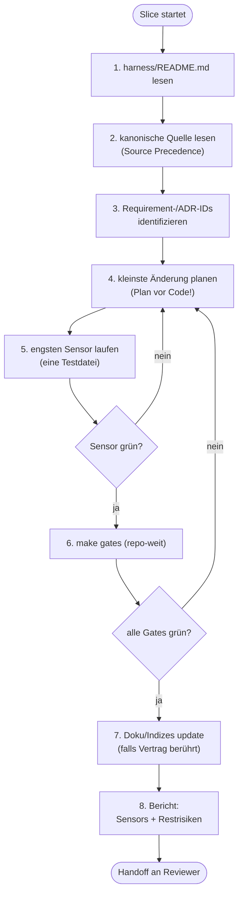

## Modul 9 — Implementierung durch KI-Agenten

<!-- Quelle: [03-agenten/modul-09-implementierung.md](https://github.com/pt9912/ai-harness-course/blob/v6.5.0/kurs/de/03-agenten/modul-09-implementierung.md) -->

### Kernidee (Modul 9)

Ein Agent ohne Plan schreibt Code. Ein Agent mit Plan schreibt das
*Richtige*. Die Reihenfolge Plan → Diff → Code ist nicht optional.

### Minimal Agent Workflow (8 Schritte)

Der Pfad, den jeder Implementer-Agent pro Slice durchläuft — und der
in `harness/README.md` als Vertrag dokumentiert wird. Strukturfragen
(Bindung-Klassen für die Sensors-Tabelle, Source-Precedence-Begründung,
Modus pro Sub-Area, Adaptionen ggü. der adoptierten Baseline) leben
in `harness/conventions.md`:

1. `harness/README.md` lesen.
2. Relevante kanonische Quelle lesen (Source Precedence beachten).
3. Betroffene Requirement-/ADR-IDs identifizieren.
4. Kleinste sinnvolle Änderung planen.
5. Engsten nützlichen Sensor laufen lassen (z. B. nur eine Testdatei).
6. Repo-weiter Gate-Lauf vor Handoff (`make gates`).
7. Doku/Indizes aktualisieren, falls ein öffentlicher Vertrag berührt ist.
8. Ausgeführte Sensors und verbleibende Risiken berichten — keine Erfolgsmeldung ohne Gate-Ausführung.

**Die Plan-Ausgabe in Schritt 4 nennt Out-of-Scope.** Das ist keine Zutat,
sondern die Schritt-Hälfte einer Regel; ihre Dokument-Hälfte ist §1 *Ziel und
Abgrenzung* des Slice-Plans (`modul-05-planning-harness.md` §Ziel-Form: Slice,
dort auch die vier Klassen und die Begründungs-Pflicht je Punkt). Der Lauf
schreibt fort, was der Plan schon ausschließt — er erfindet die Abgrenzung
nicht neu und darf sie nicht stillschweigend weiten: Nimmt der Lauf etwas mit,
das §1 ausschließt, ist das eine Plan-Änderung und gehört vor den Code, nicht
in den Bericht danach.

#### Workflow als Diagramm

Zwei Rücksprungkanten sind wesentlich: 5→4 und 6→4. Nicht
zurück zu Schritt 1 — der Plan wird *verfeinert*, nicht der Kontext neu
gelesen.

### Rücksprungkanten-Regeln (Modul 9)

- **Kein Rücksprung zu Schritt 1**, sondern nur 5→4 (Plan verfeinern)
  und 6→4 (Plan korrigieren wegen Gate). Wer in Schritt 1 zurückspringt,
  hat einen Kontext-Defekt, keinen Plan-Defekt — das ist eine andere
  Ursache und gehört in den nächsten Steering-Loop-Eintrag.
- Roter `arch-check` in Schritt 6 (ADR-Verstoß durch direkten Import):
  Rücksprung zu **Schritt 4** (Plan verfeinern) — der ADR-Verstoß ist
  ein *Plan*-Defekt, nicht ein Kontext-Defekt; der Agent kannte die ADR,
  hat den Diff aber falsch geschnitten. Konkrete Korrektur: z. B.
  Adapter-Wrapper statt direktem Import, sodass die Schichtung gewahrt
  bleibt. Rücksprung zu Schritt 1 wäre nur richtig, wenn der Agent die
  ADR gar nicht *im Kontext* hatte (Kontext-Defekt) — dann fehlt die
  kanonische Quelle, nicht der Plan. Die Wahl der Kante ist die Diagnose
  der Ursache.

### Hard Rules (repo-spezifisch)

Negativregeln, die der Agent nie brechen darf. Eine gute Hard Rule hat
*Falsch/Richtig*-Beispiele **und** eine *technische Begründung*.
Nicht jede Hard Rule in `AGENTS.md` ist repo-spezifisch: *„Architektur ist
sprach- und meilensteinfrei"* folgt aus dem Sicht-Stratum und der
Referenz-Richtung ([Modul 3 §Ziel-Form: Architektur-Sicht](modul-03-spec.md#ziel-form-architektur-sicht))
— ein Repo verkörpert sie in `AGENTS.md`, es entscheidet sie nicht. Solche
Regeln gehören in die Datei, aber nicht in diese Liste.

Bewährte Muster:

* **Docker-only**: kein lokales `.venv`, kein `pip install` außerhalb von Dockerfile-Stages.
  *Falsch:* `uv run python tools/foo.py`.
  *Richtig:* `docker compose run --rm test-runner uv run python tools/foo.py`.
  *Begründung:* Toolchain-Reproduzierbarkeit + Supply-Chain-Defense.
* **`# noqa` ist verboten**: bricht das `noqa-gate` in `make gates`. Ausnahmen werden in `pyproject.toml` mit Begründung dokumentiert.
* **Suppression-Verbot pro Sprache** — derselbe Mechanismus, andere Syntax:
  * Python: `# noqa`
  * Go: `//nolint`
  * C#: `#pragma warning disable`, `[SuppressMessage]` — ein
    Suppression-Gate der C#-Welt muss beide Formen erfassen
  * Kotlin: `@Suppress("...")`
  * Java: `@SuppressWarnings("...")`
  In jeder Sprache gilt: Inline-Suppression bricht das Suppression-Gate; Ausnahmen wandern in eine zentrale Konfigurations-Datei mit Begründung.
* **git mv + Inhaltsänderung = zwei Commits**: Move und Inhalt nie im selben Commit — der Move-Commit bleibt rein (Git erkennt R-Rename). Welcher der beiden zuerst kommt, sagt der Vorgang: im Regelfall der Move, dann der Inhalt; beim Lifecycle-Übergang nach `done/` umgekehrt, weil `done/` „Closure-Notiz vorhanden" bedeutet und die Notiz deshalb im Commit davor steht ([Modul 5 §Lifecycle als State Machine](modul-05-planning-harness.md#lifecycle-als-state-machine)).
  Und der Übergang `next → in-progress` landet auf dem **Hauptzweig, vor der
  Arbeit** — sonst ist der Zustand zweigelokal und niemand sieht den Anspruch.
  *Begründung:* Sonst fällt die Rename-Detection unter die 50 %-Similarity-Schwelle und `git log --follow` wird unzuverlässig.
* **Domänen-Beispiel (Regelungstechnik): Optimierer darf nie direkt aufs
  Gerät schreiben** — Output fließt durch Statemachine, Constraint-Limiter,
  Ramp-Limiter. Steht hier als Muster: Die härtesten Hard Rules einer Domäne
  kommen aus ihrer Fehlerkultur, nicht aus einem Standard-Satz.
* **Gates dürfen nicht ohne ADR gelockert werden**: jede Schwellen-Senkung ist ein ADR, kein PR-Kommentar.

Hard Rules sind *computational + inferential feedforward* zugleich: sie
stehen in AGENTS.md (Agent liest sie) **und** werden idealerweise durch
eine Fitness Function geprüft (Linter schlägt an). Wenn nur eines von
beiden existiert, ist die Regel nur halb durchgesetzt. Und eine **neue** Hard
Rule trägt ab Einführung einen Auflösungs-Trigger oder *permanent*
([Modul 13](modul-13-quality-gates.md#hard-rule-doku-disziplin)); der
Altbestand bleibt, wie er ist.

### Kontext-Verdichtung (Kehrseite der Lopopolo-Maxime)

Die Maxime *"Was der Agent nicht im Kontext erreicht, existiert für ihn
nicht"* (Original: *"anything it can't access in-context doesn't exist"*)
ist eine Hebellinse — sie erklärt, warum Spec, ADR und AGENTS.md *die
Hauptkontrolle* sind, nicht Beiwerk. Aber sie hat eine Kehrseite, die der
Reflex "mehr Kontext rein" gerne überliest:

- **Kontext-Pollution.** Wenn ein 14 Wochen alter ADR-Entwurf im Kontext
  steht, der mit `superseded` markiert ist, erfindet der Agent
  Begründungen *aus dem alten ADR*. Der Kontext besteht — die
  Information ist falsch. Mehr Tokens, schlechteres Ergebnis.
- **Lost in the Middle.** Auch bei großen Kontext-Fenstern fallen
  Informationen in der Mitte des Prompts deutlich seltener in den
  Output zurück als Anfang und Ende. Wer wichtige Anforderungen
  ungeordnet "dazwischen" platziert, hat sie technisch im Kontext und
  praktisch nicht.
- **Token-Kosten.** Jedes Token im Eingangskontext wird abgerechnet —
  pro Lauf, pro Tool-Call, pro Replay. Ein 30-zeiliger irrelevanter
  Block, der in 1500 PRs mitläuft (empirischer Beleg: Lopopolo,
  OpenAI 2026), ist eine Rechnung mit vier Stellen vor dem Komma.

Folge: Context Engineering ist *auch* eine Reduktions-Aufgabe.
Konkret gehört in den Lauf-Kontext:

| Pflicht | Wer? |
| --- | --- |
| `harness/README.md` | jeder Lauf |
| relevante kanonische Quelle (Source Precedence) | jeder Lauf, gezielt |
| Requirement-/ADR-IDs des Slice | jeder Lauf |
| AGENTS.md (Hard Rules + Konventionen) | jeder Lauf |
| Tool-Allowlist | jeder Lauf |

| Nicht in den Lauf-Kontext (Anti-Pattern) |
| --- |
| `superseded`/`deprecated` ADRs ohne Folge-Bezug |
| historische Spec-Diff-Notizen, die jetzt in ADR-Form gegossen sind |
| Skills, die nicht zu dieser Rolle gehören |
| ältere Carveouts, deren Auflösungs-Trigger bereits eingetreten ist |

Die Verdichtungs-Sensoren dafür sind in [Modul 15](modul-15-observability.md):
Token-Eingabe-Metrik pro Slice, Cache-Hit-Rate (siehe Mini-Glossar in
Modul 15), und der **Doku-Konsistenz-Agent** als Drift-Detektor für tote
Kontext-Stücke.

Faustregel für den 8-Schritt-Workflow: Schritt 2 ist *"kanonische Quelle
lesen"*, nicht *"alles lesen, was im Repo liegt"*. Wenn der Plan in
Schritt 4 nicht ohne Verweis auf einen Kontext-Block auskommt, gehört
dieser Block in den nächsten Lauf — alle anderen nicht.

### AGENTS.md-Regeln (Modul 9)

- AGENTS.md ist die zentrale, maschinell lesbare Konventionsdatei
  (Hard Rules + Konventionen) und gehört in jeden Lauf-Kontext.
- Minimale Eingaben eines Implementer-Agenten gegen Halluzination:
  `harness/README.md` + relevante kanonische Quelle +
  Requirement/ADR-IDs + AGENTS.md + Tool-Allowlist. Fehlende Eingaben
  werden *durch Raten ersetzt*, nicht durch Schweigen.
- Eine Hard Rule, die aus dem Steering Loop entstand (nicht aus einer
  Anforderung), trägt den Herkunfts-Anker `(seit welle-<NN>)` — ohne Welle `(seit slice-<NNN>)`
  ([`grundlagen-traceability.md` §Herkunfts-Anker](grundlagen-traceability.md#herkunfts-anker)).
- Jede Hard Rule liegt in *zwei* Quadranten: inferential feedforward
  (steht in AGENTS.md) + computational feedback (Fitness
  Function/Linter-Gate). Hard Rule nur in einem Quadranten ist halb
  durchgesetzt; nur in AGENTS.md vergisst der Agent sie unter Druck,
  nur als Fitness Function ohne AGENTS.md-Eintrag versteht der Agent
  das *Warum* nicht.
- Fertig ist ein Implementer-Agent bei DoD-erfüllt + Schritt 8
  ausgeführt (Bericht über Sensors + Restrisiken). Kompilierender Code
  ist notwendig, nicht hinreichend. Ohne Schritt-8-Bericht wird jedes
  Risiko in die nächste Rolle (Reviewer/Verifier) verlagert — das
  bricht die Kontext-Trennung der Rollen.

### Was der Agent in den Kommentar schreibt (Modul 9)

- Zwischen Schritt 4 (Plan) und Schritt 5 (engster Sensor) entsteht der Code —
  und mit ihm seine Kommentare. Es gilt die Bestimmung aus
  [`grundlagen-harness-dateien.md` §Was ein Kommentar trägt](grundlagen-harness-dateien.md#was-ein-kommentar-trägt--code-konfiguration-skripte):
  fünf Klassen, Adressaten- und Zeitform-Test.
- **Der Agent hat gerade abgewogen; genau diese Abwägung drängt in den
  Kommentar.** Sie gehört in die ADR oder in §3/§6 des Slice, nicht dorthin.
  Falsch: *„Ohne dieses Feld behauptete die Ausgabe eine Verteilung, die nicht
  stattgefunden hat."* Richtig: *„Verteilt ist wahr, wenn die Splitting-Regel
  angewendet werden konnte. Ist es falsch, liegt Sammelposten in keiner
  Rollen-Zeile."* Es verschwindet nichts Prüfbares — es verschwindet der
  Konjunktiv über die verworfene Alternative.
- **Werkzeuge, die Repos erzeugen:** Emittierte Skripte, Makefiles und
  Konfigurationen tragen keine Slice- oder Befund-Nummer des Erzeuger-Repos —
  dort existiert sie nicht, der Anker löst ins Leere auf. Beim Emittieren
  fällt er weg; die Begründung bleibt im Erzeuger-Repo, wo sie auflöst.
- **Rate, gemessen:** Ein Briefing greift am Vorsatz, nicht am Ergebnis. Auf
  ausdrückliche Anweisung wurden sieben Kommentare angefasst — fünf sauber
  umgeschrieben, einer reproduzierte das Muster im selben Diff, einer blieb als
  Trümmer stehen. Die Review-Hälfte ist keine Kür.

### Regeln gegen typische Fehlannahmen (Modul 9)

- **Gegen "Agent liefert schnell, also ist der Workflow Overhead":** Geschwindigkeit ohne Plan produziert Diffs, die später als Review-Last anfallen. Plan + Diff + Code kostet 20 % länger und spart 50 % Review.
- **Gegen "Hard Rules schreibe ich in AGENTS.md, und das reicht":** Eine Hard Rule, die nur in AGENTS.md steht (inferential feedforward), ist halbgesetzt. Erst mit Fitness Function (computational feedback) ist sie *durchgesetzt*. Beides ist Pflicht.
- **Gegen "Wenn die Tests grün sind, ist der Slice fertig":** Schritt 8 verlangt einen Bericht über *Sensors und verbleibende Risiken*. Grüne Tests sind notwendig, nicht hinreichend.
- **Gegen "Die Pre-completion Checklist ist Bürokratie":** Sie ist der einzige Schritt, der vor Übergabe an Reviewer/Verifier eine *Selbstaussage* erzwingt. Wer keinen Selbst-Check macht, lädt jedes Risiko in die nächste Rolle.
- **Gegen "Mehr Kontext ist immer besser — siehe Lopopolo":** Lopopolos *"Was der Agent nicht im Kontext erreicht, existiert für ihn nicht"* sagt: *fehlender* Kontext schadet. Es sagt **nicht**: *jeder zusätzliche* Kontext nützt. Siehe [§Kontext-Verdichtung](#kontext-verdichtung-kehrseite-der-lopopolo-maxime).
- **Gegen "Ein Agent ist ein besserer/schnellerer Programmierer":** *Geschwindigkeit ohne Plan* erzeugt Review-Last, nicht Lieferung. Faustregel: Plan-vor-Code kostet 20 % mehr Zeit *im Lauf* und spart 50 % Review-Zeit *danach* — gemessen pro Slice, nicht pro Minute. Wer den Agenten als Speed-Tool denkt, mißt am falschen Hebel: nicht Diff-pro-Stunde, sondern Slice-bis-`done/`. Belegt durch Lopopolo (~1 Mio. Zeilen Code in ~1500 PRs über fünf Monate mit *drei* Engineers — Skalierung kommt aus dem Harness, nicht aus dem Modell).

### Ziel-Form: AGENTS.md

Die repo-weite Konventionsdatei folgt der Vorlage
[`templates/AGENTS.template.md`](../templates/AGENTS.template.md): Hard Rules
mit Herkunfts-Anker, Source Precedence, Gate-Tabelle. Die Regeln zum Inhalt
stehen oben in §AGENTS.md-Regeln und §Hard Rules; die Vorlage liefert die Form.
