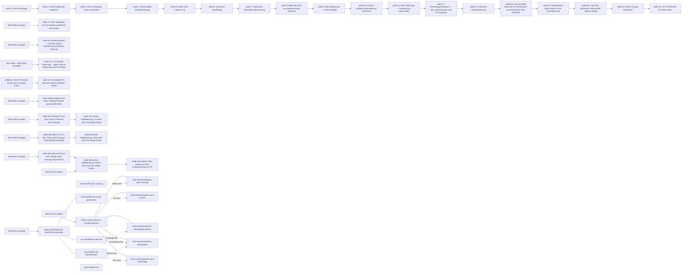

# Roadmap

**Format-Regel:** Die Roadmap ist eine Reihenfolge von **Wellen**,
keine Reihenfolge von Terminen (siehe
Baseline-Regelwerk `modul-06-roadmap.md`).
Termine werden — falls überhaupt — als Konsequenz der Wellen-Schätzung
gezeigt, nicht als Treiber.

---

## Offene Wellen

Regeln dieser Sektion: Baseline-Regelwerk `modul-06-roadmap.md`
§Roadmap-Struktur: fünf Abschnitte — *Offene Wellen* ist **derivativ**: Der
Zustand sind die flachen Welle-Dateien; woran gearbeitet wird, sagt das
`Welle:`-Feld der Slices in `in-progress/`. Ziel, Trigger und
Closure-Kriterien stehen in der Welle-Datei, nicht hier.

<!-- BEDIENHINWEIS: Zwei unabhängige Aussagen in diesem Block. Die Liste oben
folgt den Dateien (ein Zeiger je offener Welle-Datei). Trägt in-progress/
keinen Slice, kommt der Ruhe-Marker ZUSÄTZLICH dazu — nicht an Stelle der
Liste; beides zugleich ist der Normalfall direkt nach der Wellen-Eröffnung.
Zwei Aussagen, zwei Wächter: die Marker-Hälfte (Marker genau dann, wenn
in-progress/ keinen Slice trägt) und die Listen-Hälfte (Bijektion Zeiger <->
flache Welle-Dateien, in beide Richtungen; der Marker geht nicht ein). Die
Listen-Hälfte braucht einen Sensor, der das Kardinalitäts-Modell kennt — ein
Ein-Wellen-Wächter hält den Block gegen GENAU EINE Datei und meldet legitime
Zustände (mehrere offene Wellen; eine Welle eröffnet, nichts beansprucht) als
Drift. Welche Hälfte dein Sensor prüft, musst du wissen; eine ungewächterte
Hälfte ist zulässig, wenn sie benannt ist.

WORTLAUT des Markers: Baseline-Regelwerk modul-06-roadmap.md, Bullet
"Offene Wellen". Hier bewusst NICHT zitiert, und das ist eine Regel, keine
Nachlässigkeit: Ein Doku-Sensor matcht den Marker als Substring dieses
Blocks, also matcht sich jeder Regel-, Hinweis- oder Beispieltext selbst,
der den Wortlaut literal trägt — der Block meldete "Ruhe" bei beanspruchtem
Slice. Aus demselben Grund gehört der Wortlaut in keine Sektions-Regel-Zeile
oben. Wer den Sensor selbst baut: Code-Fences beim Matchen aus dem Block
nehmen, sonst schlägt ein Beispiel-Auszug durch. -->

- [welle-transformationen](../welle-transformationen.md) — Transformationen:
  erfasste Changes tragen vor der Persistierung die durch deklarative Regeln
  bestimmte Form, konfiguriert über die SQL-Antrags-Queue, zehn Slices
  ([`LH-FA-CFG-007`](../../../../spec/lastenheft.md),
  [`ADR-0112`](../../adr/0112-transformationsform-deklarative-regeln-vor-persistenz.md)).

Nichts in Arbeit — kein Slice liegt in `in-progress/` (WIP-Limit 1 gilt je
Slice, nicht je offener Welle-Datei; mehrere gleichzeitig eröffnete Wellen sind
kein Verstoß).

## Nächste Wellen

Regeln dieser Sektion: Baseline-Regelwerk `modul-06-roadmap.md`
§Roadmap-Struktur: fünf Abschnitte, Bullet *Nächste Wellen* — die geordnete
Vorschau: je Zeile Welle, Trigger als beobachtbare Bedingung, wichtigste Slices
und geschätzter Aufwand (S/M/L, kein Termin).

| Welle | Trigger | Wichtigste Slices | Geschätzter Aufwand |
|---|---|---|---|

## Meilensteine

Regeln dieser Sektion: Baseline-Regelwerk `modul-06-roadmap.md`
§Welle ≠ Meilenstein ≠ Release.

<!--
Externe Versprechen oder interne Trigger-Punkte.
"M2: erste lauffähige Fassung" ist ein Meilenstein.
Status: "offen" oder "erreicht YYYY-MM-DD" plus Beleg als auflösbarer
Anker (z. B. Tag, Workflow-Lauf, Ergebnis-Notiz). Erreichte Meilensteine
bleiben hier in der Tabelle —
sie gehören nicht ins Drift-Log, und die Status-Zelle erzählt nicht, wie es
dazu kam (Baseline-Regelwerk grundlagen-harness-dateien.md §Was ein
Kommentar trägt, "Dieselbe Regel für Zustandsfelder").
-->

| Meilenstein | Welle(n) | Trigger | Status |
|---|---|---|---|
| M1 — MVP-Abnahme | welle-1, welle-2 | MVP-Integrationstest grün ([Lastenheft §1, MVP-Schnitt](../../../../spec/lastenheft.md)) | erreicht 2026-09-10 — Beleg: `make test-integration` grün am verdrahteten System ([welle-2-results.md](../done/welle-2-results.md), Verifikation) |

## Abhängigkeitsgraph

Regeln dieser Sektion: Baseline-Regelwerk `modul-06-roadmap.md`
§Roadmap-Struktur: fünf Abschnitte, Bullet *Nächste Wellen* — die Abhängigkeit
steht als beobachtbare Bedingung in der `Trigger`-Spalte **und** als gerichtete
Kante hier; eine Welle, die ohne fertige Vorgängerin nicht starten kann, ist
eine Phantom-Welle. **Die Kante trägt das Trigger-Objekt**, nicht zwingend die
Vorgänger-Welle: ein Knoten ohne Wellen-Charakter (ein wellenloser Slice, ein
`Accepted`-ADR) steht als eigener Knoten daneben. Wo der Trigger kein
Wellen-Objekt nennt, wird **keine** Wellen-Kette gezogen — die Kante behauptete
sonst eine Abhängigkeit, die der Trigger nicht trägt. **Eine benannte Abweichung
steht in der Kette bis `welle-16`:** deren letzte Kante (`W15 --> W16`) trägt
kein Trigger-Objekt — `welle-16`s Trigger ist `ADR-0057`, nicht `welle-15`. Sie
bleibt als Reihenfolge-Kante stehen und ist damit die einzige Stelle des
Graphen, die der Regel oben nicht genügt; sie wird **benannt**, nicht still
gezogen und nicht still getilgt.

**Benannte Kopplung zwischen den beiden offenen Wellen**
([welle-backfill-bestand](../welle-backfill-bestand.md) und
[welle-transformationen](../welle-transformationen.md)): die gestrichelten
Kanten sind Start-Trigger einzelner Slices der Transformations-Welle, kein
Trigger einer Welle. **K1** — der Kern
([`LH-FA-CFG-007`](../../../../spec/lastenheft.md), Regelauswertung im Row
Image) startet nach `slice-backfill-row-image-gemeinsam`; **K2** — der Slice, der
den Backfill-Pfad an die Regelauswertung bindet
([`ADR-0112`](../../adr/0112-transformationsform-deklarative-regeln-vor-persistenz.md)
Folgepflicht 7), folgt `slice-backfill-run-usecase` und zusätzlich
`slice-backfill-e2e`; **K3** — der Antragsweg der Transformationen erweitert
die `request_kind`-Menge nach `slice-backfill-sql-administration`; dazu die
gemeinsame Änderung von [`SPEC-019`](../../../../spec/pflichtenheft.md) (Spec-Nachzug
nach `slice-backfill-spec-nachzug`) und die gemeinsame Startpfad-Stelle in
`internal/bootstrap/wiring.go` (`slice-transformationen-start-reihenfolge` nach
`slice-backfill-sql-administration`). Ausführung und Begründung der
Reihenfolge (Backfill zuerst) stehen in
[welle-backfill-bestand](../welle-backfill-bestand.md) §5 und
[welle-transformationen](../welle-transformationen.md) §5.

## Abgeschlossene Wellen

Regeln dieser Sektion: Baseline-Regelwerk `modul-06-roadmap.md`
§Roadmap-Struktur: fünf Abschnitte.

| Welle | Abschluss | Closure-Notiz |
|---|---|---|
| welle-1 — MVP-Grundlage | 2026-09-09 | [welle-1-results.md](../done/welle-1-results.md) |
| welle-2 — Reale PostgreSQL-Integration | 2026-09-10 | [welle-2-results.md](../done/welle-2-results.md) |
| welle-3 — CDC-Verwaltung, Lesen-Vollabdeckung, Sicherheit und Observability-Basis | 2026-09-10 | [welle-3-results.md](../done/welle-3-results.md) |
| welle-4 — Observability-Vervollständigung | 2026-09-10 | [welle-4-results.md](../done/welle-4-results.md) |
| welle-5 — Realer CDC-Capture-Lag | 2026-09-12 | [welle-5-results.md](../done/welle-5-results.md) |
| welle-6 — Consumer-Zugriffsweg | 2026-09-12 | [welle-6-results.md](../done/welle-6-results.md) |
| welle-7 — Replication-Schwellen-Überwachung | 2026-09-12 | [welle-7-results.md](../done/welle-7-results.md) |
| welle-8 — Black-Box-E2E und Integrationstest-Nachzug | 2026-09-12 | [welle-8-results.md](../done/welle-8-results.md) |
| welle-9 — E2E-Abdeckung — CDC-Kernpfad | 2026-09-12 | [welle-9-results.md](../done/welle-9-results.md) |
| welle-10 — Schema-Evolution-Nachlieferung (`ADR-0015`) | 2026-09-12 | [welle-10-results.md](../done/welle-10-results.md) |
| welle-11 — E2E-Abdeckung — Verwaltung & Observability | 2026-09-13 | [welle-11-results.md](../done/welle-11-results.md) |
| welle-12 — Verwaltungsfunktionen — SQL-Administration & CLI-Diagnose | 2026-09-13 | [welle-12-results.md](../done/welle-12-results.md) |
| welle-13 — Retention-Löschausführung | 2026-09-13 | [welle-13-results.md](../done/welle-13-results.md) |
| welle-14 — Performance-Benchmarks & Test-Coverage-Gate | 2026-09-13 | [welle-14-results.md](../done/welle-14-results.md) |
| welle-15 — NATS-Change-Notification | 2026-09-14 | [welle-15-results.md](../done/welle-15-results.md) |
| welle-16 — HTTP/JSON-API mit Token-Authn (`LH-FA-SST-006`, `ADR-0057`) | 2026-09-14 | [welle-16-results.md](../done/welle-16-results.md) |
| welle-17 — E2E-Testbelege für fünf testfreie Lastenheft-Kennungen (`ADR-0058`) | 2026-09-14 | [welle-17-results.md](../done/welle-17-results.md) |
| welle-18 — Spaltenauswahl — Antrags-Queue-Erweiterung, Assembler-Filterung, E2E-Beleg (`LH-FA-CFG-005`, `ADR-0059`) | 2026-09-14 | [welle-18-results.md](../done/welle-18-results.md) |
| welle-19 — Live-Change-Streaming — gRPC-Server-Streaming und HTTP/SSE (`LH-FA-SST-008`, `ADR-0060`, `ADR-0061`) | 2026-09-15 | [welle-19-results.md](../done/welle-19-results.md) |
| welle-20 — Coverage 80 % über der netzlos prüfbaren Fläche (`ADR-0071`, `ADR-0082`) | 2026-09-17 | [welle-20-results.md](../done/welle-20-results.md) |
| welle-d-check — `d-check`-Erweiterung: Getrackt-Status und Requirements-Traceability-Matrix | 2026-09-17 | [welle-d-check-results.md](../done/welle-d-check-results.md) |
| welle-archive-altbestand — Erste Archivierung dieses Repos (wellenloser Altbestand + `welle-d-check`) | 2026-09-18 | [welle-archive-altbestand-results.md](../done/welle-archive-altbestand-results.md) |
| welle-beispiele-start-ueber-make — Beispiel-Clients: Start über `make`/Dockerfile statt `go run`, echter Start-Make-Target, Demo-Umgebung mit Bootstrapping (`ADR-0098`) | 2026-09-18 | [welle-beispiele-start-ueber-make-results.md](../done/welle-beispiele-start-ueber-make-results.md) |
| welle-nats-drittstream — NATS als dritter, paralleler Vollinhalts-Zustellweg für Live-Streaming, volle Drei-Sprachen-Matrix (`LH-FA-SST-008`, `ADR-0100`) | 2026-09-18 | [welle-nats-drittstream-results.md](../done/welle-nats-drittstream-results.md) |
| welle-release-pipeline-adr-0051 — Release-Pipeline gemäß `ADR-0051` vollständig umsetzen: Versionierung/`release.yml`, CVE-Scan, Upstream-Pin-Freshness, Docker-Hub-Beschreibungs-Sync, Betreiber-Doku | 2026-09-19 | [welle-release-pipeline-adr-0051-results.md](../done/welle-release-pipeline-adr-0051-results.md) |
| welle-sdk-csharp-lh-fa-sst-009 — Erstes C#/NuGet-SDK-Package (`PgChangeFeed.Client`) für `LH-FA-SST-009` (`ADR-0106`) | 2026-09-19 | [welle-sdk-csharp-lh-fa-sst-009-results.md](../done/welle-sdk-csharp-lh-fa-sst-009-results.md) |
| welle-sdk-python-lh-fa-sst-009 — Zweites SDK-Package (Python/PyPI, `pgchangefeed`) für `LH-FA-SST-009` (`ADR-0107`, `ADR-0108`) | 2026-09-19 | [welle-sdk-python-lh-fa-sst-009-results.md](../done/welle-sdk-python-lh-fa-sst-009-results.md) |
| welle-sdk-kotlin-lh-fa-sst-009 — Drittes SDK-Package (Kotlin/GitHub Packages, `pgchangefeed-kotlin`) für `LH-FA-SST-009` (`ADR-0109`) | 2026-09-21 | [welle-sdk-kotlin-lh-fa-sst-009-results.md](../done/welle-sdk-kotlin-lh-fa-sst-009-results.md) |
| welle-sdk-csharp-vollabdeckung — C#/NuGet-SDK auf volle Vier-Wege-Parität erweitern (SSE, NATS-Vollinhalt, `ADR-0106`) | 2026-09-22 | [welle-sdk-csharp-vollabdeckung-results.md](../done/welle-sdk-csharp-vollabdeckung-results.md) |
| welle-sdk-kotlin-vollabdeckung — Kotlin/GitHub-Packages-SDK auf volle Vier-Wege-Parität erweitern (SSE, NATS-Vollinhalt, `ADR-0109`) | 2026-09-22 | [welle-sdk-kotlin-vollabdeckung-results.md](../done/welle-sdk-kotlin-vollabdeckung-results.md) |
| welle-sdk-python-vollabdeckung — Python/PyPI-SDK auf volle Vier-Wege-Parität erweitern (gRPC, SSE, NATS-Vollinhalt, `ADR-0110`) | 2026-09-23 | [welle-sdk-python-vollabdeckung-results.md](../done/welle-sdk-python-vollabdeckung-results.md) |
| welle-sdk-reale2e — SDK-Realserver-E2E: die zwölf Zustellweg-Flächen der drei SDK-Packages (3 Sprachen × 4 Wege) tragen reale Server-Belege, Abdeckungs-Träger `docs/user/sdk-e2e-abdeckung.md` + `trace.coverage`-Eintrag (Label `SDK-E2E`) (`ADR-0110`) | 2026-09-23 | [welle-sdk-reale2e-results.md](../done/welle-sdk-reale2e-results.md) |
| welle-backfill-bestand — Backfill des Bestands: der Tabellenbestand einer aktivierten Tabelle wird als Backfill erkennbar (`origin`) über den bestehenden Lesezugriffsweg lesbar, elf Slices (`LH-FA-CAP-009`, `ADR-0111`) | 2026-09-25 | [welle-backfill-bestand-results.md](../done/welle-backfill-bestand-results.md) |

## Historische Trigger-Verschiebungen

Regeln dieser Sektion: Baseline-Regelwerk `modul-06-roadmap.md`
§Roadmap-Struktur: fünf Abschnitte, Bullet *Historische Trigger-Verschiebungen*
— das Drift-Log: jede Umplanung mit Datum, Änderung, Grund. Leer heißt starre
Roadmap, jede Zeile voll heißt treibende.

<!--
Wenn Wellen umgeplant wurden: Datum, Grund, neue Reihenfolge.
Steering-Loop-relevant.
NUR Umplanungen: Trigger verschoben, präzisiert oder ersetzt; Slice oder
Welle umgehängt. KEINE Schließungen (die stehen im Closure-Log oben) und
KEINE erreichten Meilensteine (Status-Spalte) — sonst führt diese Tabelle ein
zweites Closure-Log, und zwei Logs driften.
-->

| Datum | Was wurde geändert? | Warum? |
|---|---|---|
| 2026-09-12 | Neue Feature-Welle „Schema-Evolution-Nachlieferung (`ADR-0015`)" zwischen `welle-9` und „E2E-Abdeckung — Verwaltung & Observability" eingefügt; deren Trigger von „`welle-9` liegt in `done/`" auf „Vorherige Welle (Schema-Evolution-Nachlieferung) liegt in `done/`" umgehängt. | `slice-030` fand real, dass [`ADR-0015`](../../adr/0015-schema-evolution.md)s Folgepflicht (`SchemaStorePort`, dynamische Re-Versionierung) nie eingelöst wurde (Review zu `slice-030` F-1 HIGH, der Architect-Verdikt zu `slice-030`/`ADR-0015`) — Größenordnung Feature-Welle, nicht Einzel-Slice. |
| 2026-09-12 | Neue Feature-Welle „Verwaltungsfunktionen — SQL-Administration (`LH-FA-ADM-001`)" zwischen „E2E-Abdeckung — Verwaltung & Observability" und „Retention-Löschausführung" eingefügt; „E2E-Abdeckung — Verwaltung & Observability"s Scope auf den bereits existierenden Lesezugriff (`LH-FA-CFG-003`/`004`, `LH-FA-ADM-002`…`005`) präzisiert, ihr fälschlicher Bezug zu `BEO-PGC/rollen-test-abdeckungsluecken` gestrichen; „Retention-Löschausführung"s Trigger entsprechend umgehängt. | Fork-Recherche zur Eröffnung von `welle-11` fand real, dass [`LH-FA-ADM-001`](../../../../spec/lastenheft.md) (Lastenheft, Rang 1) explizite SQL-Administrationsfunktionen (Aktivierung/Deaktivierung/Status/Consumer-Verwaltung) verlangt, die nicht existieren, und dass `LH-FA-CFG-002` (Deaktivierung) keinen Live-Zugriffsweg hat — registriert als `BEO-PGC/verwaltung-keine-sql-administration`; Größenordnung Feature-Welle, kein Testabdeckungs-Defizit. |
| 2026-09-13 | „Retention-Löschausführung" als `welle-13` eröffnet (verlässt *Nächste Wellen*, Zeiger unter *Offene Wellen*); „E2E-Abdeckung — Retention"s Trigger von „Vorherige Welle (Retention-Löschausführung) liegt in `done/`" auf „`welle-13` liegt in `done/`" präzisiert. | `welle-12` liegt in `done/`, der Architect-Verdikt zur Löschausführung liegt vor — Eröffnungs-Trigger erfüllt. |
| 2026-09-13 | „E2E-Abdeckung — Retention" aus *Nächste Wellen* entfernt — kein eigener Welle-Schnitt mehr, sondern der wellenlose `slice-047` (Diagnose-CLI-Erweiterung für Retention-Sichtbarkeit); „Performance-Benchmarks & Test-Coverage-Gate"s Trigger von „Vorherige Welle (E2E-Abdeckung Retention) liegt in `done/`" auf „`slice-047` liegt in `done/`" umgehängt. | Eröffnungs-Recherche (Fork) fand real: Die SQL-View-Black-Box-Ebene für Retention ist bereits vollständig geliefert (`slice-045`/`046` selbst, kein Go-Domain-Import); nur die `diagnose`-CLI-Sichtbarkeit fehlt real — ein einzelner Slice ohne Closure-Bedingung jenseits seiner eigenen DoD trägt laut Baseline-Regelwerk `modul-06-roadmap.md` §Wann Arbeit eine Welle braucht keine eigene Welle. |
| 2026-09-13 | Header-Absatz „E2E-Abdeckungsprogramm" (Nutzerentscheidung 2026-09-12, ursprünglich vier Wellen: `welle-9`, `welle-11`, `welle-13`, „E2E-Abdeckung — Retention") aus *Nächste Wellen* entfernt — er stand fälschlich über den drei völlig unabhängigen Folgezeilen (Performance-Benchmarks, Publication-Entzug, NATS), nachdem die vorherige Korrektur seine letzte zugehörige Tabellenzeile entfernt hatte, ohne den darüberstehenden Programm-Header mitzuziehen. Das Programm selbst ist damit vollständig abgeschlossen: drei seiner vier Wellen liegen in `done/` (`welle-9`, `welle-11`, `welle-13`), die vierte wurde wie oben beschrieben als wellenloser `slice-047`/`048` statt als eigene Welle realisiert. | Nutzerfrage („warum steht das in roadmap.md?") deckte real auf, dass der Header nach der vorherigen Zeilen-Entfernung verwaist stehen geblieben war. |
| 2026-09-13 | „Performance-Benchmarks & Test-Coverage-Gate" als `welle-14` eröffnet (verlässt *Nächste Wellen*, Zeiger unter *Offene Wellen*); „Publication-Entzug-Wirksamkeit"s Trigger von „Vorherige Welle (Performance-Benchmarks) liegt in `done/`" auf „`welle-14` liegt in `done/`" präzisiert. | `slice-047` liegt in `done/`, Architect-Verdikt zu Scope/Schwelle/Suppression liegt vor ([ADR-0054](../../adr/0054-coverage-gate-und-benchmark-infrastruktur.md)) — Eröffnungs-Trigger erfüllt; zwei unabhängige Slices geschnitten (`slice-049` Coverage-Gate, `slice-050` Benchmark-Infrastruktur). |
| 2026-09-13 | „Publication-Entzug-Wirksamkeit am laufenden Stream" aus *Nächste Wellen* entfernt — kein eigener Welle-Schnitt mehr, sondern der wellenlose `slice-051` (isolierter Walsender-Timing-Beleg); „`LH-FA-SST-007` — NATS-Change-Notification"s Trigger von „Vorherige Welle (Publication-Entzug-Wirksamkeit) liegt in `done/`" auf „`slice-051` liegt in `done/`" umgehängt. | Eröffnungs-Recherche (Fork) plus der Architect-Verdikt zur Walsender-Wirksamkeit fanden real: kein Mehr über einen einzelnen isolierten Testabschnitt hinaus, keine Schema-/Domänen-Änderung — trägt laut Baseline-Regelwerk `modul-06-roadmap.md` §Wann Arbeit eine Welle braucht keine eigene Welle. |
| 2026-09-13 | „`LH-FA-SST-007` — NATS-Change-Notification" als `welle-15` eröffnet (verlässt *Nächste Wellen*, Zeiger unter *Offene Wellen*) — vier Slices geschnitten (`slice-052` Port/Adapter, `slice-053` Compose-Verdrahtung/Happy-Path, `slice-054` Boundary-Beleg, `slice-055` Negative-Beleg). Damit ist *Nächste Wellen* leer — es steht keine weitere Welle in der Vorschau. | `slice-051` liegt in `done/`, [ADR-0055](../../adr/0055-nats-change-notification-wecksignal.md) (Accepted) liegt vor — Eröffnungs-Trigger erfüllt; die im Lastenheft komplett unimplementierte Anforderung erfordert laut ADR mindestens vier voneinander abhängige Liefer-Punkte (Grundgerüst, Verdrahtung, Boundary-Beleg, Negative-Beleg), die einzeln DoD-fähig, aber gemeinsam erst `LH-FA-SST-007` vollständig belegen — genau das *Mehr* gegenüber den Einzel-DoDs. |
| 2026-09-25 | [welle-backfill-bestand](../welle-backfill-bestand.md) um den elften Slice `slice-backfill-slot-leerlauf-bestaetigung` erweitert (Start nach `slice-backfill-bench-richtgroesse`, vor der Welle-Closure); der Closure-Trigger der Welle zählt elf Slices und trägt ein Kriterium zum WAL-Rückstand eines Runs. Keine neue Kante zu [welle-transformationen](../welle-transformationen.md). | Das Architect-Verdikt [architect-verdict-backfill-wal-rueckstand-und-bench-rot](../../../reviews/architect-verdict-backfill-wal-rueckstand-und-bench-rot.md) und [`ADR-0120`](../../adr/0120-capture-slot-leerlauf-bestaetigung.md) verlangen einen eigenen Slice: der Eingriff berührt den Capture-kritischen Pfad (Empfangs-Schleife, Application, Port) und ein Run überschritt in einer Messung die Fehlerschwelle des WAL-Rückstands, obwohl [`ADR-0111`](../../adr/0111-backfill-bestand-snapshot-bulk-copy.md) den Capture-Pfad als unberührt zusagt. |
| 2026-09-25 | [welle-transformationen](../welle-transformationen.md): zwei Kanten zu wellenlosen Slices — `slice-harness-suchlauf-nachmessen` geht `slice-transformationen-kern-rename` voraus, `slice-capture-leerlauf-quellbelege` geht `slice-transformationen-e2e-abhilfe` voraus; der Start-Trigger von `slice-transformationen-backfill-pfad` (Architect-Kurzverdikt) verweist auf [`ADR-0117`](../../adr/0117-backfill-run-fehlerklasse-schema.md). | Der Lese-Schritt der Closure von [welle-backfill-bestand](../welle-backfill-bestand.md) (Architect-Verdikt [architect-verdict-welle-backfill-bestand-lese-schritt](../../../reviews/architect-verdict-welle-backfill-bestand-lese-schritt.md)) schneidet vier wellenlose Folge-Slices; zwei berühren Stellen der Welle Transformationen (Suchlauf-Feld der zehn Pläne, Container-Ende-Grenze im selben Runner), das Kurzverdikt liegt mit der ADR vor. |
