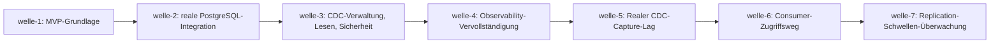

# Roadmap

**Format-Regel:** Die Roadmap ist eine Reihenfolge von **Wellen**,
keine Reihenfolge von Terminen (siehe
Baseline-Regelwerk `modul-06-roadmap.md`).
Termine werden — falls überhaupt — als Konsequenz der Wellen-Schätzung
gezeigt, nicht als Treiber.

---

## Offene Wellen

Regeln dieser Sektion: Baseline-Regelwerk `modul-06-roadmap.md`
§Roadmap-Struktur: fünf Abschnitte — *Offene Wellen* ist **derivativ**: Der
Zustand sind die flachen Welle-Dateien; woran gearbeitet wird, sagt das
`Welle:`-Feld der Slices in `in-progress/`. Ziel, Trigger und
Closure-Kriterien stehen in der Welle-Datei, nicht hier.

<!-- BEDIENHINWEIS: Zwei unabhängige Aussagen in diesem Block. Die Liste oben
folgt den Dateien (ein Zeiger je offener Welle-Datei). Trägt in-progress/
keinen Slice, kommt der Ruhe-Marker ZUSÄTZLICH dazu — nicht an Stelle der
Liste; beides zugleich ist der Normalfall direkt nach der Wellen-Eröffnung.
Zwei Aussagen, zwei Wächter: die Marker-Hälfte (Marker genau dann, wenn
in-progress/ keinen Slice trägt) und die Listen-Hälfte (Bijektion Zeiger <->
flache Welle-Dateien, in beide Richtungen; der Marker geht nicht ein). Die
Listen-Hälfte braucht einen Sensor, der das Kardinalitäts-Modell kennt — ein
Ein-Wellen-Wächter hält den Block gegen GENAU EINE Datei und meldet legitime
Zustände (mehrere offene Wellen; eine Welle eröffnet, nichts beansprucht) als
Drift. Welche Hälfte dein Sensor prüft, musst du wissen; eine ungewächterte
Hälfte ist zulässig, wenn sie benannt ist.

WORTLAUT des Markers: Baseline-Regelwerk modul-06-roadmap.md, Bullet
"Offene Wellen". Hier bewusst NICHT zitiert, und das ist eine Regel, keine
Nachlässigkeit: Ein Doku-Sensor matcht den Marker als Substring dieses
Blocks, also matcht sich jeder Regel-, Hinweis- oder Beispieltext selbst,
der den Wortlaut literal trägt — der Block meldete "Ruhe" bei beanspruchtem
Slice. Aus demselben Grund gehört der Wortlaut in keine Sektions-Regel-Zeile
oben. Wer den Sensor selbst baut: Code-Fences beim Matchen aus dem Block
nehmen, sonst schlägt ein Beispiel-Auszug durch. -->

- [welle-7 — Replication-Schwellen-Überwachung](../welle-7.md)

## Nächste Wellen

Regeln dieser Sektion: Baseline-Regelwerk `modul-06-roadmap.md`
§Roadmap-Struktur: fünf Abschnitte, Bullet *Nächste Wellen* — die geordnete
Vorschau: je Zeile Welle, Trigger als beobachtbare Bedingung, wichtigste Slices
und geschätzter Aufwand (S/M/L, kein Termin).

| Welle | Trigger | Wichtigste Slices | Geschätzter Aufwand |
|---|---|---|---|
| Publication-Entzug-Wirksamkeit am laufenden Stream | `welle-7` liegt in `done/` | Slice(s), die `BEO-PGC/walsender-wirksamkeit` schließen: Wirksamkeits-Beleg für Disable am live laufenden Walsender (Neuaufbau-Wait oder Stream-Neustart-Behandlung) | S |
| `LH-FA-SST-007` — NATS-Change-Notification | Vorherige Welle (Publication-Entzug-Wirksamkeit) liegt in `done/` | Noch nicht geschnitten — mindestens: NATS-Publish-Adapter bei Commit, Nachhol-Garantie für nicht verbundene Consumer (`LH-FA-SST-007` Boundary), Wiederverbindungs-Verhalten (`LH-FA-SST-007` Negative) | L |

## Meilensteine

Regeln dieser Sektion: Baseline-Regelwerk `modul-06-roadmap.md`
§Welle ≠ Meilenstein ≠ Release.

<!--
Externe Versprechen oder interne Trigger-Punkte.
"M2: erste lauffähige Fassung" ist ein Meilenstein.
Status: "offen" oder "erreicht YYYY-MM-DD" plus Beleg als auflösbarer
Anker (z. B. Tag, Workflow-Lauf, Ergebnis-Notiz). Erreichte Meilensteine
bleiben hier in der Tabelle —
sie gehören nicht ins Drift-Log, und die Status-Zelle erzählt nicht, wie es
dazu kam (Baseline-Regelwerk grundlagen-harness-dateien.md §Was ein
Kommentar trägt, "Dieselbe Regel für Zustandsfelder").
-->

| Meilenstein | Welle(n) | Trigger | Status |
|---|---|---|---|
| M1 — MVP-Abnahme | welle-1, welle-2 | MVP-Integrationstest grün ([Lastenheft §1, MVP-Schnitt](../../../../spec/lastenheft.md)) | erreicht 2026-09-10 — Beleg: `make test-integration` grün am verdrahteten System ([welle-2-results.md](../done/welle-2-results.md), Verifikation) |

## Abhängigkeitsgraph

Regeln dieser Sektion: Baseline-Regelwerk `modul-06-roadmap.md`
§Roadmap-Struktur: fünf Abschnitte, Bullet *Nächste Wellen* — die Abhängigkeit
steht als beobachtbare Bedingung in der `Trigger`-Spalte **und** als gerichtete
Kante hier; eine Welle, die ohne fertige Vorgängerin nicht starten kann, ist
eine Phantom-Welle.

## Abgeschlossene Wellen

Regeln dieser Sektion: Baseline-Regelwerk `modul-06-roadmap.md`
§Roadmap-Struktur: fünf Abschnitte.

| Welle | Abschluss | Closure-Notiz |
|---|---|---|
| welle-1 — MVP-Grundlage | 2026-09-09 | [welle-1-results.md](../done/welle-1-results.md) |
| welle-2 — Reale PostgreSQL-Integration | 2026-09-10 | [welle-2-results.md](../done/welle-2-results.md) |
| welle-3 — CDC-Verwaltung, Lesen-Vollabdeckung, Sicherheit und Observability-Basis | 2026-09-10 | [welle-3-results.md](../done/welle-3-results.md) |
| welle-4 — Observability-Vervollständigung | 2026-09-10 | [welle-4-results.md](../done/welle-4-results.md) |
| welle-5 — Realer CDC-Capture-Lag | 2026-09-12 | [welle-5-results.md](../done/welle-5-results.md) |
| welle-6 — Consumer-Zugriffsweg | 2026-09-12 | [welle-6-results.md](../done/welle-6-results.md) |

## Historische Trigger-Verschiebungen

Regeln dieser Sektion: Baseline-Regelwerk `modul-06-roadmap.md`
§Roadmap-Struktur: fünf Abschnitte, Bullet *Historische Trigger-Verschiebungen*
— das Drift-Log: jede Umplanung mit Datum, Änderung, Grund. Leer heißt starre
Roadmap, jede Zeile voll heißt treibende.

<!--
Wenn Wellen umgeplant wurden: Datum, Grund, neue Reihenfolge.
Steering-Loop-relevant.
NUR Umplanungen: Trigger verschoben, präzisiert oder ersetzt; Slice oder
Welle umgehängt. KEINE Schließungen (die stehen im Closure-Log oben) und
KEINE erreichten Meilensteine (Status-Spalte) — sonst führt diese Tabelle ein
zweites Closure-Log, und zwei Logs driften.
-->

| Datum | Was wurde geändert? | Warum? |
|---|---|---|
| YYYY-MM-DD | <…> | <…> |
