# Roadmap

**Format-Regel:** Die Roadmap ist eine Reihenfolge von **Wellen**,
keine Reihenfolge von Terminen (siehe
Baseline-Regelwerk `modul-06-roadmap.md`).
Termine werden — falls überhaupt — als Konsequenz der Wellen-Schätzung
gezeigt, nicht als Treiber.

---

## Offene Wellen

Regeln dieser Sektion: Baseline-Regelwerk `modul-06-roadmap.md`
§Roadmap-Struktur: fünf Abschnitte — *Offene Wellen* ist **derivativ**: Der
Zustand sind die flachen Welle-Dateien; woran gearbeitet wird, sagt das
`Welle:`-Feld der Slices in `in-progress/`. Ziel, Trigger und
Closure-Kriterien stehen in der Welle-Datei, nicht hier.

<!-- BEDIENHINWEIS: Zwei unabhängige Aussagen in diesem Block. Die Liste oben
folgt den Dateien (ein Zeiger je offener Welle-Datei). Trägt in-progress/
keinen Slice, kommt der Ruhe-Marker ZUSÄTZLICH dazu — nicht an Stelle der
Liste; beides zugleich ist der Normalfall direkt nach der Wellen-Eröffnung.
Zwei Aussagen, zwei Wächter: die Marker-Hälfte (Marker genau dann, wenn
in-progress/ keinen Slice trägt) und die Listen-Hälfte (Bijektion Zeiger <->
flache Welle-Dateien, in beide Richtungen; der Marker geht nicht ein). Die
Listen-Hälfte braucht einen Sensor, der das Kardinalitäts-Modell kennt — ein
Ein-Wellen-Wächter hält den Block gegen GENAU EINE Datei und meldet legitime
Zustände (mehrere offene Wellen; eine Welle eröffnet, nichts beansprucht) als
Drift. Welche Hälfte dein Sensor prüft, musst du wissen; eine ungewächterte
Hälfte ist zulässig, wenn sie benannt ist.

WORTLAUT des Markers: Baseline-Regelwerk modul-06-roadmap.md, Bullet
"Offene Wellen". Hier bewusst NICHT zitiert, und das ist eine Regel, keine
Nachlässigkeit: Ein Doku-Sensor matcht den Marker als Substring dieses
Blocks, also matcht sich jeder Regel-, Hinweis- oder Beispieltext selbst,
der den Wortlaut literal trägt — der Block meldete "Ruhe" bei beanspruchtem
Slice. Aus demselben Grund gehört der Wortlaut in keine Sektions-Regel-Zeile
oben. Wer den Sensor selbst baut: Code-Fences beim Matchen aus dem Block
nehmen, sonst schlägt ein Beispiel-Auszug durch. -->

Nichts in Arbeit.

## Nächste Wellen

Regeln dieser Sektion: Baseline-Regelwerk `modul-06-roadmap.md`
§Roadmap-Struktur: fünf Abschnitte, Bullet *Nächste Wellen* — die geordnete
Vorschau: je Zeile Welle, Trigger als beobachtbare Bedingung, wichtigste Slices
und geschätzter Aufwand (S/M/L, kein Termin).

**E2E-Abdeckungsprogramm** (Nutzerentscheidung 2026-09-12: alle implementierten
Fähigkeiten sollen Black-Box-E2E-Abdeckung bekommen — vier Wellen, gebaut auf
dem Aufrufmuster aus `welle-8`/`slice-027`; Retention-Löschausführung ist
bewusst als eigene Feature-Welle abgetrennt, nicht als E2E-Testarbeit):

| Welle | Trigger | Wichtigste Slices | Geschätzter Aufwand |
|---|---|---|---|
| E2E-Abdeckung — Verwaltung & Observability | Vorherige Welle (Schema-Evolution-Nachlieferung) liegt in `done/` | Noch nicht geschnitten — Black-Box-E2E für den bereits existierenden Lesezugriff auf CDC-Status/-Liste (`LH-FA-CFG-003`/`004` gegen `cdc.active_tables`) und Administration/Observability (`LH-FA-ADM-002`…`005`, Konsolidierung); deckt dabei die `LH-FA-SST-003`-CLI-Diagnoselücke auf. **Nicht in dieser Welle:** SQL-Administrationsfunktionen und CDC-Deaktivierung — kein Live-Zugriffsweg vorhanden, reine Feature-Arbeit, siehe nächste Zeile. `BEO-PGC/rollen-test-abdeckungsluecken` ist inhaltlich **nicht** berührt (Fork-Recherche 2026-09-12 widerlegt den ursprünglichen Bezug). | M |
| Verwaltungsfunktionen — SQL-Administration (`LH-FA-ADM-001`) | Vorherige Welle (E2E-Abdeckung Verwaltung & Observability) liegt in `done/` | Noch nicht geschnitten — reine Feature-Arbeit: `LH-FA-ADM-001` verlangt explizit SQL-Funktionen für Aktivierung/Deaktivierung/Statusabfrage/Consumer-Verwaltung (`cdc.enable_table(...)`, `cdc.disable_table(...)`), die real nicht existieren; `LH-FA-CFG-002` (Deaktivierung) hat aktuell **keinen** Live-Zugriffsweg (`disable.NewDisableTableService` nirgends verdrahtet). Schließt `BEO-PGC/verwaltung-keine-sql-administration` | L |
| Retention-Löschausführung | Vorherige Welle (Verwaltungsfunktionen — SQL-Administration) liegt in `done/` | Noch nicht geschnitten — reine Feature-Arbeit: tatsächliche Löschausführung für `LH-FA-RET-002`…`006` (Use-Case/CLI/Job, der `RetentionPolicy.AllowsDeletion` real aufruft) plus Metrik `cdc_storage_bytes`; schließt `BEO-PGC/retention-keine-loeschausfuehrung` | L |
| E2E-Abdeckung — Retention | Vorherige Welle (Retention-Löschausführung) liegt in `done/` | Noch nicht geschnitten — Black-Box-E2E für die neu gebaute Löschausführung; ohne die vorherige Welle gäbe es nichts zu testen | M |
| Performance-Benchmarks & Test-Coverage-Gate | Vorherige Welle (E2E-Abdeckung Retention) liegt in `done/` | Noch nicht geschnitten — (a) Mess-Infrastruktur für `LH-QA-PER-001`…`003` (Quell-Impact, Skalierung, Batch-Effizienz); andere Disziplin als E2E-Tests (Benchmark statt Pass/Fail); (b) Go-Test-Coverage-Gate (`go test -coverprofile`, Schwelle 80 % — Modul 13 „Schwellen sind ADR-pflichtig", eigene ADR nötig) ohne Suppression-Möglichkeit ohne zentral dokumentierte Ausnahme (Muster: `/Development/KI/ai-harness-init/.golangci.yml` `exclusions.rules` mit `Why:`-Begründung statt Inline-`//nolint`); füllt dabei `AGENTS.md` §3.2 (Suppression-Verbot) aus, das in diesem Repo noch der unausgefüllte Template-Platzhalter ist | L |
| Publication-Entzug-Wirksamkeit am laufenden Stream | Vorherige Welle (Performance-Benchmarks) liegt in `done/` | Slice(s), die `BEO-PGC/walsender-wirksamkeit` schließen: Wirksamkeits-Beleg für Disable am live laufenden Walsender (Neuaufbau-Wait oder Stream-Neustart-Behandlung) | S |
| `LH-FA-SST-007` — NATS-Change-Notification | Vorherige Welle (Publication-Entzug-Wirksamkeit) liegt in `done/` | Noch nicht geschnitten — mindestens: NATS-Publish-Adapter bei Commit, Nachhol-Garantie für nicht verbundene Consumer (`LH-FA-SST-007` Boundary), Wiederverbindungs-Verhalten (`LH-FA-SST-007` Negative) | L |

## Meilensteine

Regeln dieser Sektion: Baseline-Regelwerk `modul-06-roadmap.md`
§Welle ≠ Meilenstein ≠ Release.

<!--
Externe Versprechen oder interne Trigger-Punkte.
"M2: erste lauffähige Fassung" ist ein Meilenstein.
Status: "offen" oder "erreicht YYYY-MM-DD" plus Beleg als auflösbarer
Anker (z. B. Tag, Workflow-Lauf, Ergebnis-Notiz). Erreichte Meilensteine
bleiben hier in der Tabelle —
sie gehören nicht ins Drift-Log, und die Status-Zelle erzählt nicht, wie es
dazu kam (Baseline-Regelwerk grundlagen-harness-dateien.md §Was ein
Kommentar trägt, "Dieselbe Regel für Zustandsfelder").
-->

| Meilenstein | Welle(n) | Trigger | Status |
|---|---|---|---|
| M1 — MVP-Abnahme | welle-1, welle-2 | MVP-Integrationstest grün ([Lastenheft §1, MVP-Schnitt](../../../../spec/lastenheft.md)) | erreicht 2026-09-10 — Beleg: `make test-integration` grün am verdrahteten System ([welle-2-results.md](../done/welle-2-results.md), Verifikation) |

## Abhängigkeitsgraph

Regeln dieser Sektion: Baseline-Regelwerk `modul-06-roadmap.md`
§Roadmap-Struktur: fünf Abschnitte, Bullet *Nächste Wellen* — die Abhängigkeit
steht als beobachtbare Bedingung in der `Trigger`-Spalte **und** als gerichtete
Kante hier; eine Welle, die ohne fertige Vorgängerin nicht starten kann, ist
eine Phantom-Welle.

```mermaid
flowchart LR
    W1[welle-1: MVP-Grundlage]
    W2[welle-2: reale PostgreSQL-Integration]
    W3[welle-3: CDC-Verwaltung, Lesen, Sicherheit]
    W4[welle-4: Observability-Vervollständigung]
    W5[welle-5: Realer CDC-Capture-Lag]
    W6[welle-6: Consumer-Zugriffsweg]
    W7[welle-7: Replication-Schwellen-Überwachung]
    W8[welle-8: Black-Box-E2E und Integrationstest-Nachzug]
    W9[welle-9: E2E-Abdeckung — CDC-Kernpfad]
    W9B[welle-10: Schema-Evolution-Nachlieferung ADR-0015]
    W10[geplant: E2E-Abdeckung — Verwaltung & Observability]
    W10B[geplant: Verwaltungsfunktionen — SQL-Administration LH-FA-ADM-001]
    W11[geplant: Retention-Löschausführung]
    W12[geplant: E2E-Abdeckung — Retention]
    W13[geplant: Performance-Benchmarks & Test-Coverage-Gate]
    W14[geplant: Publication-Entzug-Wirksamkeit]
    W15[geplant: LH-FA-SST-007 NATS-Change-Notification]

    W1 --> W2 --> W3 --> W4 --> W5 --> W6 --> W7 --> W8 --> W9 --> W9B --> W10 --> W10B --> W11 --> W12 --> W13 --> W14 --> W15
```

## Abgeschlossene Wellen

Regeln dieser Sektion: Baseline-Regelwerk `modul-06-roadmap.md`
§Roadmap-Struktur: fünf Abschnitte.

| Welle | Abschluss | Closure-Notiz |
|---|---|---|
| welle-1 — MVP-Grundlage | 2026-09-09 | [welle-1-results.md](../done/welle-1-results.md) |
| welle-2 — Reale PostgreSQL-Integration | 2026-09-10 | [welle-2-results.md](../done/welle-2-results.md) |
| welle-3 — CDC-Verwaltung, Lesen-Vollabdeckung, Sicherheit und Observability-Basis | 2026-09-10 | [welle-3-results.md](../done/welle-3-results.md) |
| welle-4 — Observability-Vervollständigung | 2026-09-10 | [welle-4-results.md](../done/welle-4-results.md) |
| welle-5 — Realer CDC-Capture-Lag | 2026-09-12 | [welle-5-results.md](../done/welle-5-results.md) |
| welle-6 — Consumer-Zugriffsweg | 2026-09-12 | [welle-6-results.md](../done/welle-6-results.md) |
| welle-7 — Replication-Schwellen-Überwachung | 2026-09-12 | [welle-7-results.md](../done/welle-7-results.md) |
| welle-8 — Black-Box-E2E und Integrationstest-Nachzug | 2026-09-12 | [welle-8-results.md](../done/welle-8-results.md) |
| welle-9 — E2E-Abdeckung — CDC-Kernpfad | 2026-09-12 | [welle-9-results.md](../done/welle-9-results.md) |
| welle-10 — Schema-Evolution-Nachlieferung (`ADR-0015`) | 2026-09-12 | [welle-10-results.md](../done/welle-10-results.md) |

## Historische Trigger-Verschiebungen

Regeln dieser Sektion: Baseline-Regelwerk `modul-06-roadmap.md`
§Roadmap-Struktur: fünf Abschnitte, Bullet *Historische Trigger-Verschiebungen*
— das Drift-Log: jede Umplanung mit Datum, Änderung, Grund. Leer heißt starre
Roadmap, jede Zeile voll heißt treibende.

<!--
Wenn Wellen umgeplant wurden: Datum, Grund, neue Reihenfolge.
Steering-Loop-relevant.
NUR Umplanungen: Trigger verschoben, präzisiert oder ersetzt; Slice oder
Welle umgehängt. KEINE Schließungen (die stehen im Closure-Log oben) und
KEINE erreichten Meilensteine (Status-Spalte) — sonst führt diese Tabelle ein
zweites Closure-Log, und zwei Logs driften.
-->

| Datum | Was wurde geändert? | Warum? |
|---|---|---|
| 2026-09-12 | Neue Feature-Welle „Schema-Evolution-Nachlieferung (`ADR-0015`)" zwischen `welle-9` und „E2E-Abdeckung — Verwaltung & Observability" eingefügt; deren Trigger von „`welle-9` liegt in `done/`" auf „Vorherige Welle (Schema-Evolution-Nachlieferung) liegt in `done/`" umgehängt. | `slice-030` fand real, dass [`ADR-0015`](../../adr/0015-schema-evolution.md)s Folgepflicht (`SchemaStorePort`, dynamische Re-Versionierung) nie eingelöst wurde (`docs/reviews/review-slice-030.md` F-1 HIGH, Architect-Verdikt `docs/reviews/architect-verdict-slice-030-adr-0015.md`) — Größenordnung Feature-Welle, nicht Einzel-Slice. |
| 2026-09-12 | Neue Feature-Welle „Verwaltungsfunktionen — SQL-Administration (`LH-FA-ADM-001`)" zwischen „E2E-Abdeckung — Verwaltung & Observability" und „Retention-Löschausführung" eingefügt; „E2E-Abdeckung — Verwaltung & Observability"s Scope auf den bereits existierenden Lesezugriff (`LH-FA-CFG-003`/`004`, `LH-FA-ADM-002`…`005`) präzisiert, ihr fälschlicher Bezug zu `BEO-PGC/rollen-test-abdeckungsluecken` gestrichen; „Retention-Löschausführung"s Trigger entsprechend umgehängt. | Fork-Recherche zur Eröffnung von `welle-11` fand real, dass [`LH-FA-ADM-001`](../../../../spec/lastenheft.md) (Lastenheft, Rang 1) explizite SQL-Administrationsfunktionen (Aktivierung/Deaktivierung/Status/Consumer-Verwaltung) verlangt, die nicht existieren, und dass `LH-FA-CFG-002` (Deaktivierung) keinen Live-Zugriffsweg hat — registriert als `BEO-PGC/verwaltung-keine-sql-administration`; Größenordnung Feature-Welle, kein Testabdeckungs-Defizit. |
