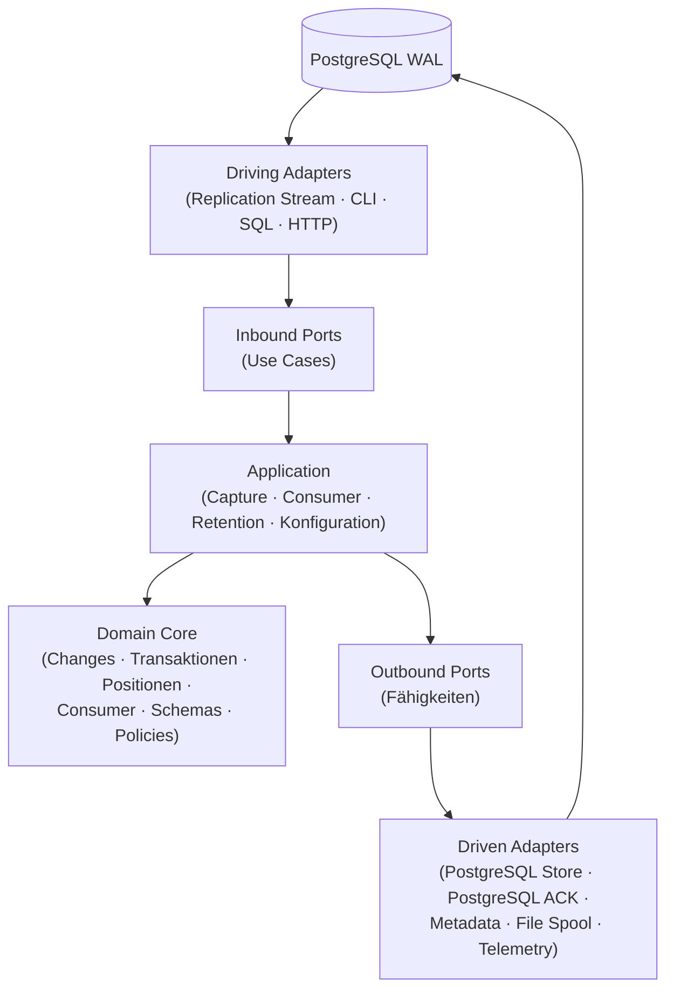
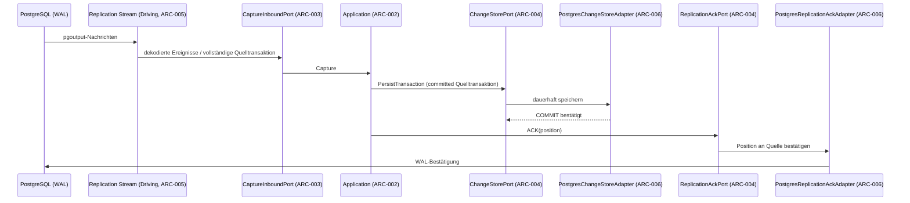
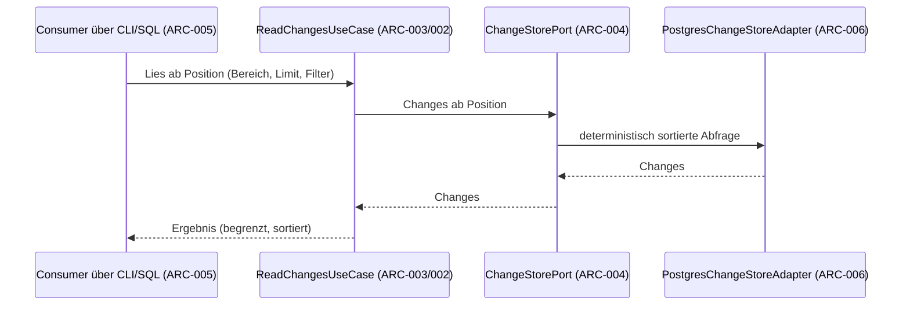
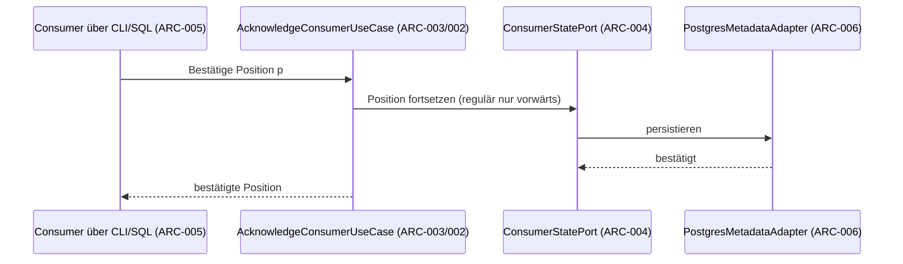
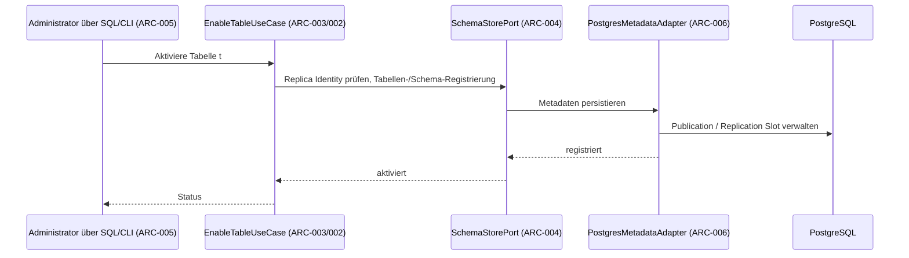

# Architektur — PG Change Feed

**Status:** Aktiv. **Letzte Änderung:** 2026-09-09.

**Rolle:** Sicht-Stratum — *keine* eigenen Anforderungen, derivativ. Regeln:
Baseline-Regelwerk `modul-03-spec.md` §Ziel-Form: Architektur-Sicht.

**Hard Rule:** Diese Datei enthält *keine* Wellen, Slices, Commit-Hashes
oder Closure-Daten, **keine ADR-Bezüge** — die Sicht steht im
Stabilitäts-Rang über der ADR — und **keine Historie**: `Letzte Änderung`
oben ist ein Frische-Marker, kein Protokoll. Die zeitliche Schicht lebt in
`docs/plan/planning/in-progress/roadmap.md` und den späteren Closure-Notizen.
Baseline-Regelwerk `modul-03-spec.md` §Ziel-Form: Architektur-Sicht.

---

## 1. Komponenten-Übersicht

Regeln dieser Sektion: **Hier werden die `ARC-*` für Komponenten vergeben** —
eine Zeile je Kasten des Diagramms, damit es *eine* Stelle gibt. Die Kennung
ist eine Adresse, damit ein Slice sagen kann, welche Komponente er
berührt; sie ist **keine** Anforderung. Gezählt wird fortlaufend je Datei —
§3 setzt die Reihe fort, statt neu zu beginnen (Baseline-Regelwerk
`grundlagen-source-precedence.md` §ID-Schema als Klammer, §Vergabe).

Die Architektur ist hexagonal (Ports & Adapters): Driving Adapters rufen
Inbound Ports auf; Application Services verwenden Outbound Ports; Driven
Adapters implementieren Outbound Ports. Für den Capture-Pfad ist PostgreSQL
Logical Replication **Driving** (über den Replication Stream); für die
WAL-Bestätigung ist PostgreSQL **Driven** (über den ReplicationAckPort) —
dieselbe Quelle steht auf beiden Seiten in unterschiedlichen Rollen.

| ID | Komponente | Rolle |
|---|---|---|
| `ARC-001` | Domain Core | Domänenobjekte und Invarianten: Source, SourceTable, ChangeTransaction, Change, SourcePosition, Consumer, ConsumerPosition, SchemaVersion, RetentionPolicy; pur, ohne Treiber |
| `ARC-002` | Application | Use-Case-Orchestrierung: Capture, Consumer-Verwaltung, Retention, Konfiguration |
| `ARC-003` | Inbound Ports | Fähigkeitsschnittstellen, über die Driving Adapters die Use Cases aufrufen |
| `ARC-004` | Outbound Ports | Fähigkeitsschnittstellen, über die Application Services technische Wirkungen anfordern |
| `ARC-005` | Driving Adapters | Technik → Use Case: Replication Stream, CLI, SQL-Funktionen/Views, später HTTP-/gRPC |
| `ARC-006` | Driven Adapters | Fähigkeit → Technik: PostgreSQL Store, PostgreSQL ACK, Metadata, File Spool, Telemetry |
| `ARC-007` | Bootstrap | Composition Root: kennt als einzige Komponente konkrete Adapter und verdrahtet alles |

## 2. Schichten und Constraints

Regeln dieser Sektion: Welche ADR eine Layering-Regel verbindlich macht,
deklariert die ADR aufwärts in ihrem `Schärft:`-Feld — kein ADR-Bezug in dieser
Sicht (Baseline-Regelwerk `grundlagen-referenz-richtung.md` §Referenz-Richtung (SDP)).

Eine Schicht ist eine *Gruppierung* über Komponenten, keine eigene Sache:
Fällt sie mit einer Komponente zusammen, nennt die Zeile deren `ARC-*` aus §1;
umfasst sie mehrere, bleibt die Spalte leer und die Constraint gilt für alle.

| Komponente(n) | Schicht | Verantwortlichkeit | Darf importieren | Darf NICHT importieren |
|---|---|---|---|---|
| `ARC-001` | Domain | Domänenmodell, Invarianten, Retention-Policy | — | alles andere: Treiber, Frameworks, PostgreSQL, Dateisystem, Telemetrie |
| `ARC-003` / `ARC-004` | Ports | Schnittstellen der Use Cases und Fähigkeiten | Domain-Typen (`ARC-001`) | konkrete Adapter und Technologien |
| `ARC-002` | Application | Use Cases, Orchestrierung | Domain (`ARC-001`), Ports (`ARC-003`, `ARC-004`) | konkrete Adapter, Treiber-Frameworks |
| `ARC-005` | Driving | technische Ereignisse/Aufrufe → Use Cases | Inbound Ports (`ARC-003`) | Domain-Interna, Driven Adapters, Application-Interna |
| `ARC-006` | Driven | Fähigkeiten → technische Wirkungen | Outbound Ports (`ARC-004`) | Driving Adapters, Inbound Ports |
| `ARC-007` | Bootstrap | Verdrahtung (Composition Root) | alles oben | — |

Abhängigkeiten zeigen nach innen: Adapters → Application → Domain. Die
Domain kennt keine PostgreSQL-, HTTP-, CLI-, Metrics- oder
Dateisystembibliotheken. Die Abhängigkeitsregel soll maschinell geprüft
werden (Import-Linting im CI); solange dieses Gate nicht existiert, ist
sie Review-Prüfpflicht.

## 3. Externe Abhängigkeiten

Regeln dieser Sektion: Auch die Schnittstelle zu einem externen System trägt
eine `ARC-*` — die Kennung benennt den *Berührungspunkt*, nicht das fremde
System (Baseline-Regelwerk `grundlagen-source-precedence.md` §ID-Schema als Klammer).

| ID | System | Rolle | Substituierbarkeit |
|---|---|---|---|
| `ARC-008` | PostgreSQL Logical Replication (`pgoutput`) | Änderungsquelle: der Replication Stream ist der Driving Adapter des Capture-Pfads | Output-Plugin als Standard ohne zusätzliche Extension; konkrete Bibliothek ist Infrastrukturdetail |
| `ARC-009` | PostgreSQL (Store) | persistenter CDC-Speicher (Referenzimplementierung des ChangeStore) | über den Outbound Port substituierbar; kein externer Broker für den Grundbetrieb erforderlich |
| `ARC-010` | Dateisystem | Spool für große offene Transaktionen | über den Outbound Port substituierbar; Crash-Verhalten testpflichtig |
| `ARC-011` | Telemetrie-Backend (Prometheus/OpenTelemetry) | Metriken und strukturierte Logs | über den Outbound Port substituierbar; Frameworks bleiben Infrastruktur |

## 4. Sequenz-Diagramme

### Use-Case: LH-QA-REL-001.a — Persist-before-ACK (Capture)

Die Bestätigung gegenüber PostgreSQL erfolgt ausschließlich über Positionen,
deren abhängige Changes bereits dauerhaft gespeichert wurden. Stream und ACK
dürfen dieselbe technische Verbindung verwenden, sind architektonisch
getrennte Rollen.

### Use-Case: LH-FA-REA-002 — Lesen ab Position

Lesen verändert gespeicherte Positionen nicht.

### Use-Case: LH-FA-CON-004 — Consumer-ACK

Reset ist eine explizite administrative Sonderoperation, keine reguläre ACK.

### Use-Case: LH-FA-CFG-001.a — Tabelle aktivieren

## 5. Fehlermodelle und Resilienz

| Fehlerquelle | Behandlung-Schicht | Logging |
|---|---|---|
| Replication-Stream-/Slot-Störung (`ARC-008`) | Driving Adapter übersetzt in die Klasse `replication`; Application entscheidet über kontrollierte Fortsetzung mit begrenztem Backoff | strukturiert mit Klassen-Feld; Schwellen beobachtbar (§3, `cdc_wal_retention_bytes`) |
| Persistenzfehler im ChangeStore (`ARC-009`) | Driven Adapter meldet Klasse `storage`; Application setzt keinen Source-ACK — Wiederholung wird gegenüber Datenverlust bevorzugt | strukturiert mit Klassen-Feld |
| Dekodier- und Schemafehler | Adapter melden Klasse `schema`; sichtbarer Fehler, kein stillers Überspringen und keine stille Fehlinterpretation | strukturiert mit Klassen-Feld |
| Berechtigungsfehler | Adapter melden Klasse `permission`; sichtbarer Fehler, kein stiller Retry | strukturiert mit Klassen-Feld |
| Konfigurationsfehler | Bootstrap meldet Klasse `configuration` beim Start; kein Start im falschen Stand | strukturiert mit Klassen-Feld |
| Unerwarteter interner Fehler | Klasse `internal`; kontrollierter Neustart und Fortsetzung aus persistierten Zuständen | strukturiert mit Klassen-Feld |

Die Fehlerklassen sind die sieben stabilen Kategorien aus dem Pflichtenheft
(SPEC-008); Adapter übersetzen technische Fehler in diese Kategorien,
entscheiden aber nicht über Wiederholung — das liegt in der Application.
Logs enthalten keine Credentials.